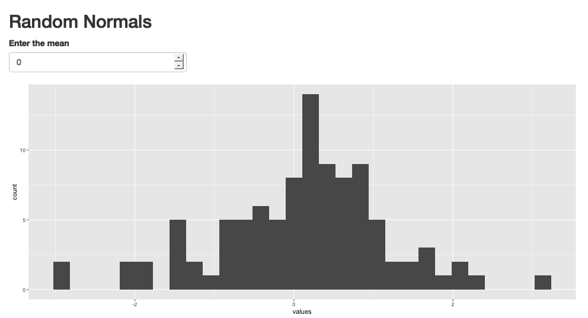
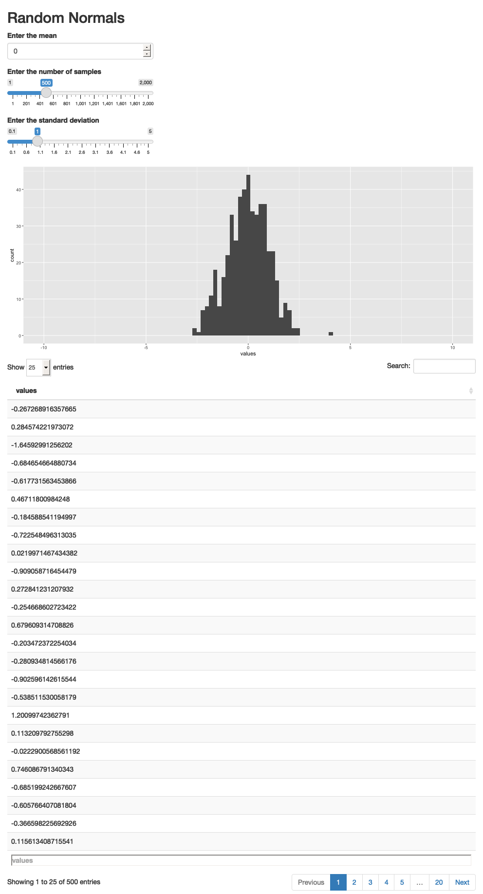
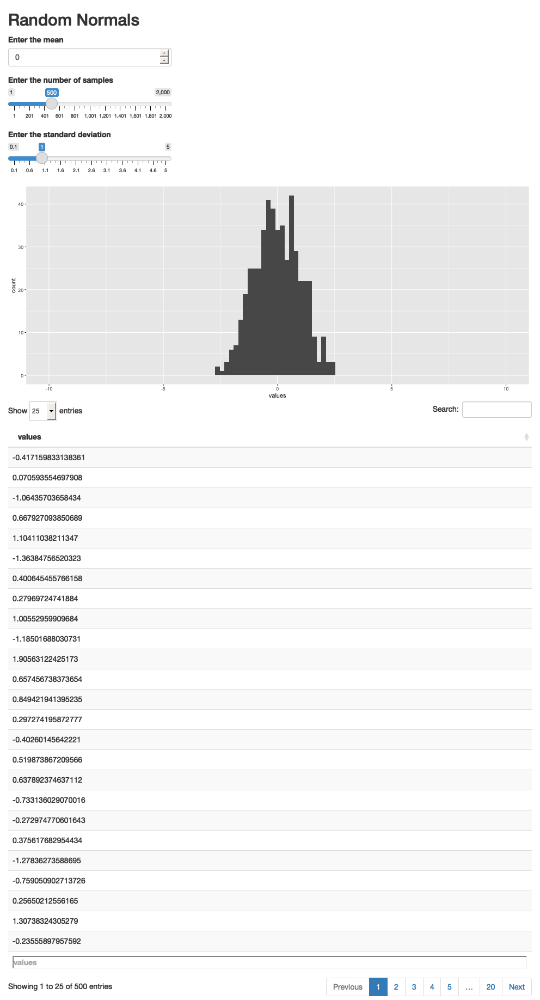

```{r, echo = FALSE}
library(knitr)
library(webshot)
knitr::opts_chunk$set(cache = FALSE, message = FALSE, warning = FALSE, echo = TRUE, fig.height = 5, retina = 4)
```

_[Reading](https://mastering-shiny.org/basic-reactivity.html), [Recording](https://mediaspace.wisc.edu/media/Week%204%20%5B1%5D%20Elements%20of%20a%20Shiny%20App/1_hlaot6li),  [Rmarkdown](https://github.com/krisrs1128/stat479_s22/blob/main/_posts/2022-02-10-week04-01/week04-01.Rmd)_

1. All Shiny apps are made up from the same few building blocks. These notes
review the main types of blocks. When reading code from more complex apps, it
can be helpful to try to classify pieces of the code into these types of blocks.

1. The highest level breakdown of Shiny app code is between `ui` and `server`
components. The `ui` controls what the app _looks like_. It stands for "User
Interface." The `server` controls what the app _does_. For example, the app
below defines a title and textbox where users can type. But it does not do
anything, since the server is empty.
    
    ```{r code=readLines("apps/app1.R")}
    ```
    
    ```{r, echo = FALSE, fig.cap = "Screenshot of the app defined above."}
    appshot(app = "apps/app1.R", file = "app1.png", vheight = 400)
    include_graphics("app1.png")
    ```
    
    Note that in this an all the remaining Shiny examples, I've just included a
    screenshot of the app. If you copy and run the code into a R file, you will
    be able to run the app interactively. You can also just download the code
    directly from the course github page.

1. The UI elements can be further broken down into Inputs, Outputs, and
Descriptors^[I like to use these names to keep everything organized, but they are not official, and you do not need to memorize this.], all grouped together by an organizing layout function. Inputs are
UI elements that users can manipulate to prompt certain types of computation.
Outputs are parts of the interface that reflects the result of a `server`
computation. Descriptors are parts of the page that aren't involved in
computation, but which provide narrative structure and guide the user. 

    For example, in the toy app above, `titlePage` is a descriptor providing
    some title text. `textInput` is an input element allowing users to enter
    text. `fluidPage` is a layout function that arranges these elements on a
    continuous page (some other layout functions are `sidebarLayout`,
    `navbarPage`, `flowLayout`, ...)

1. An important point is that all input and output elements must be given a
unique ID. This is always the first argument of a `*Input` or `*Output` function
defined in Shiny. The ID tags are how different parts of the application are
able to refer to one another. For example, if we wanted to refer to the text the
user entered in the application above, we could refer to the `name` ID.

1. Let's see how to (1) make user inputs cause some sort of computation and (2)
have the result of that computation appear to the user. For (1), we will add a
`renderText` element to the `server`. All `render*` functions do two things,

    * They make inputs from the `ui` available for computation.
    * They generate HTML code that allows the results of the computation to
    appear in a UI output.
    
    For (2), we will add a `textOutput` element to the `ui` layout defined
    above. Let's look at the code,
    
    ```{r code=readLines("apps/app2.R")}
    ```
    
    ```{r, echo = FALSE}
    appshot(app = "apps/app2.R", file = "app2.png", vheight = 400)
    
    ```
    
1. There are a few points worth noting. First, the `renderText` component was
able to refer to the value entered in the textbox using `input$name`. This was
possible because `name` was the ID that we gave to the `textInput` component. It
also would not have worked if we had used `input$text` outside of a `render*`
function: this is what we mean by the `render*` functions making the UI inputs
available for computation. Finally, we were able to refer to the rendered output
in the UI by adding a `textOutput` component. By giving this component the id
`printed_name`, we were able to tell it to look into the server for a rendered
output named `printed_name` and fill it in.

1. An even deeper idea is that the code did not simply run linearly, from top of
the script to the bottom. If that were all the code did, then it would have run
once at the beginning, and it would never have updated when you entered your
name. Instead, it ran _every time you typed into the textbox_. This is the
"reactive programming" paradigm, and it is what makes interactive visualization
possible. `renderText` knows to rerun every time something is entered into the
`name` text input, because we told it to depend on `input$name`. We will explore
the idea of reactivity in more depth in the next lecture, but for now, just
remember that the order in which code is executed is not simply determined by
the order of lines in a file.

1. Let's look at a few more examples, just to get a feel for things. The app
below updates a plot of random normal variables given a mean specified by the
user. We've introduced a new type of input, a `numericInput`, which captures
numbers. We've also added a new output, `plotOutput`, allowing with its
accompanying renderer, `renderPlot` (remember, UI outputs are always paired with
server renderers).
    
    ```{r code=readLines("apps/app3.R")}
    ```
    
    ```{r, echo = FALSE}
    appshot(app = "apps/app3.R", file = "app3.png", vheight = 400, delay=5)
    
    ```
    

1. We can make the plot depend on several inputs. The code below allows the user
to change the total number of data points and the variance, this time using
slider inputs. I recommend taking a look at different inputs on the shiny
[cheatsheet](https://shiny.rstudio.com/images/shiny-cheatsheet.pdf), though be
aware that there are many
[extensions](https://github.com/nanxstats/awesome-shiny-extensions) built by the
community.
    
    ```{r code=readLines("apps/app4.R")}
    ```
    
    ```{r, echo = FALSE}
    appshot(app = "apps/app4.R", file = "app4.png", vheight = 400, delay=5)
    include_graphics("app4.png")
    ```

1. We can also make the app return several outputs, not just a plot. The code
below attempts to print the data along in addition to the histogram, but it
makes a crucial mistake (can you spot it?).
    
    ```{r code=readLines("apps/app5.R")}
    ```
    
    ```{r, echo = FALSE}
    appshot(app = "apps/app5.R", file = "app5.png", vheight = 400, delay=5)
    
    ```
    
1. The issue is that this code reruns `rnorm` for each output. So, even though
the interfaces suggests that the printed samples are the same as the ones in the
histogram, they are actually different. To resolve this, we need a way of
storing an intermediate computation which (1) depends on the inputs but (2)
feeds into several outputs. Whenever we encounter this need, we can use a
reactive expression. It is a type of server element that depends on the input
and can be referred to directly by outputs, which call the reactive expression
like a function. For example, the code below generates the random normal samples
a single time, using the `samples()` reactive expression.
    
    ```{r code=readLines("apps/app6.R")}
    ```
    
    ```{r, echo = FALSE}
    appshot(app = "apps/app6.R", file = "app6.png", vheight = 400, delay=5)
    
    ```
    
1. Finally, a good practice is to move as much non-app related code to separate
functions. This makes the flow of the app more transparent. The clearer the
delineation between "computation required for individual app components" and
"relationship across components," the easier the code will be to understand and
extend.

    ```{r code=readLines("apps/app7.R")}
    ```
    
    ```{r, echo = FALSE}
    appshot(app = "apps/app7.R", file = "app7.png", vheight = 400, delay=5)
    
    ```
