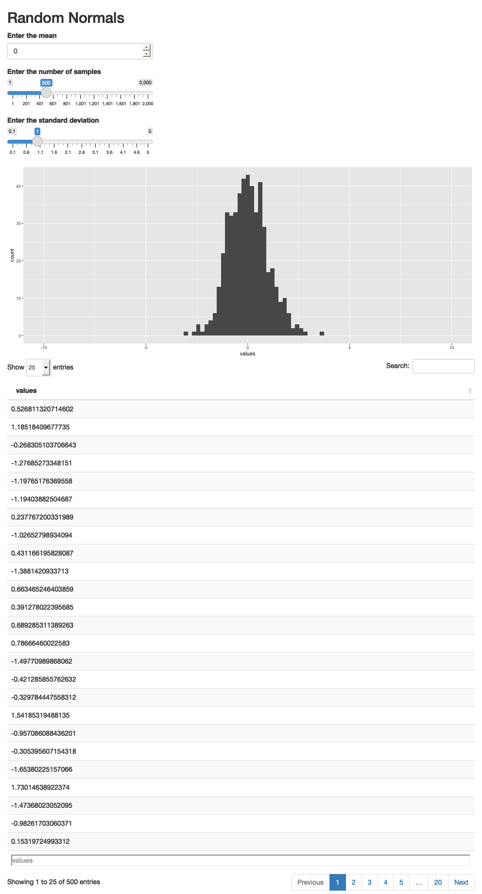

```{r, echo = FALSE}
library(knitr)
knitr::opts_chunk$set(cache = TRUE, message = FALSE, warning = FALSE, echo = TRUE, fig.height = 5, retina = 4)
```


_[Reading](https://mastering-shiny.org/basic-reactivity.html), [Recording](https://mediaspace.wisc.edu/media/Week%204%20%5B2%5D%20Introduction%20to%20Reactivity/1_2k4w97vg),  [Rmarkdown](https://github.com/krisrs1128/stat479_s22/blob/main/_posts/2022-02-10-week04-02/week04-02.Rmd)_

1. These notes will explore the idea of reactivity in more depth. Recall that
reactivity refers to the fact that Shiny app code is not run from top to bottom,
like an ordinary R script. Instead, it runs reactively, depending on inputs that
the user has provided. This can make writing Shiny code a bit unintuitive at
first, but there are a few higher-level concepts that can help when writing
reactive code.

1. The most important of these concepts is that reactive code can be viewed as a
graph. The `ui` and `server` define an explicit dependency structure for how
components depend on one another. The `input$`'s within `render*` functions in
the server specify how UI inputs affect server computations. The IDs within the
`*Output` elements in the `ui` specify which of the rendered `output$`'s in the
server should be used to populate the visible interface.

1. For example, our first "Hello" app has the following (simple) reactivity
graph. Note that I've drawn input and output nodes differently, to emphasize the
flow of computation. I've also copied the code from the original app for
reference.
    
    ```{r, echo = FALSE}
    
    ```
        

    ```{r code=readLines("apps/app1.R")}
    ```
    
    ```{r, echo = FALSE}
    appshot(app = "apps/app1.R", file = "app1.png", vheight = 400, delay=5)
    include_graphics("app1.png")
    ```

1. Even though the graph is simple, note that the outputs will be recomputed
each time that the input is changed. For more general graphs, all downstream
nodes will be re-executed whenever an upstream source is changed (typically by a
user input, though it's possible to trigger changes automatically).

1. Reactive expressions provide a special kind of node that live between inputs
and outputs. They depend on inputs, and they feed into outputs, but they are
never made directly visible to the user. This is why we've drawn them as a kind
of special intermediate node. Below, I've drawn the graph for our random normal
plotter, with the reactive `samples()` expression.

    ```{r, echo = FALSE}
    include_graphics("figures/reactive_histo.png")
    ```
  

    ```{r code=readLines("apps/app2.R")}
    ```
    
    ```{r, echo = FALSE}
    appshot(app = "apps/app2.R", file = "app2.png", vheight = 400, delay=5)
    
    ```

1. A useful perspective is to think of reactive expressions as simplifying the
overall reactivity graph. Specifically, by adding a reactive node, it's possible
to trim away many edges. For example, our initial implementation of the random
normal plotter (which didn't use the reactive expression) has a much more
complicated graph, since many inputs feed directly into outputs.

    ```{r, echo = FALSE}
    
    ```

1. Let's see these principles in action for a similar, but more complex app. The
app below can be used for power analysis. It simulates two groups of samples,
both from normal distributions, but with different (user specified) means. We've
used a reactive expression to generate the samples, so that both the histogram
and hypothesis test result outputs can refer to the same intermediate simulated
data.

    ```{r code=readLines("apps/app3.R")}
    ```
    
    ```{r, echo = FALSE}
    appshot(app = "apps/app3.R", file = "app3.png", vheight = 400, delay=5)
    
    ```
    
    Other than that, the only difference is that I've saved output from the
    `t.test` using `test_result`. Notice the use of the `broom` package, which
    helps format the test output into a `data.frame`.
    
1. So far, all of our reactive code has lived within the `render*` or
`reactive()` sets of functions. However, there is a another kind that is often
useful, especially in more advanced applications: `observers`. An observer is a
computation that is done every time certain inputs are changed, but which don't
affect downstream UI outputs through a `render*` function. For example, below,
we've added a block (under `observeEvent`) that prints to the console every time
either of the means are changed. I realize it is a bit of a mystery why these
functions would ever be useful, but we will see them in more realistic contexts
next week.

    ```{r code=readLines("apps/app4.R")}
    ```
    
    ```{r, echo = FALSE}
    appshot(app = "apps/app4.R", file = "app4.png", vheight = 400, delay=5)
    
    ```
