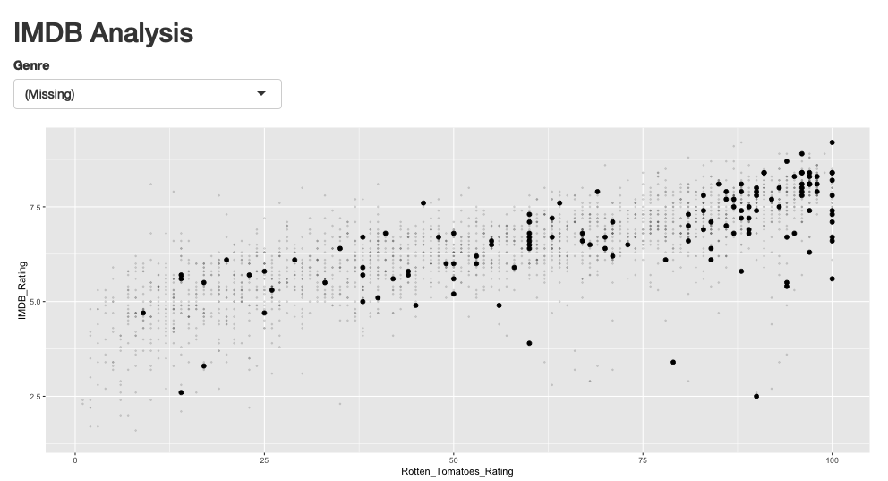
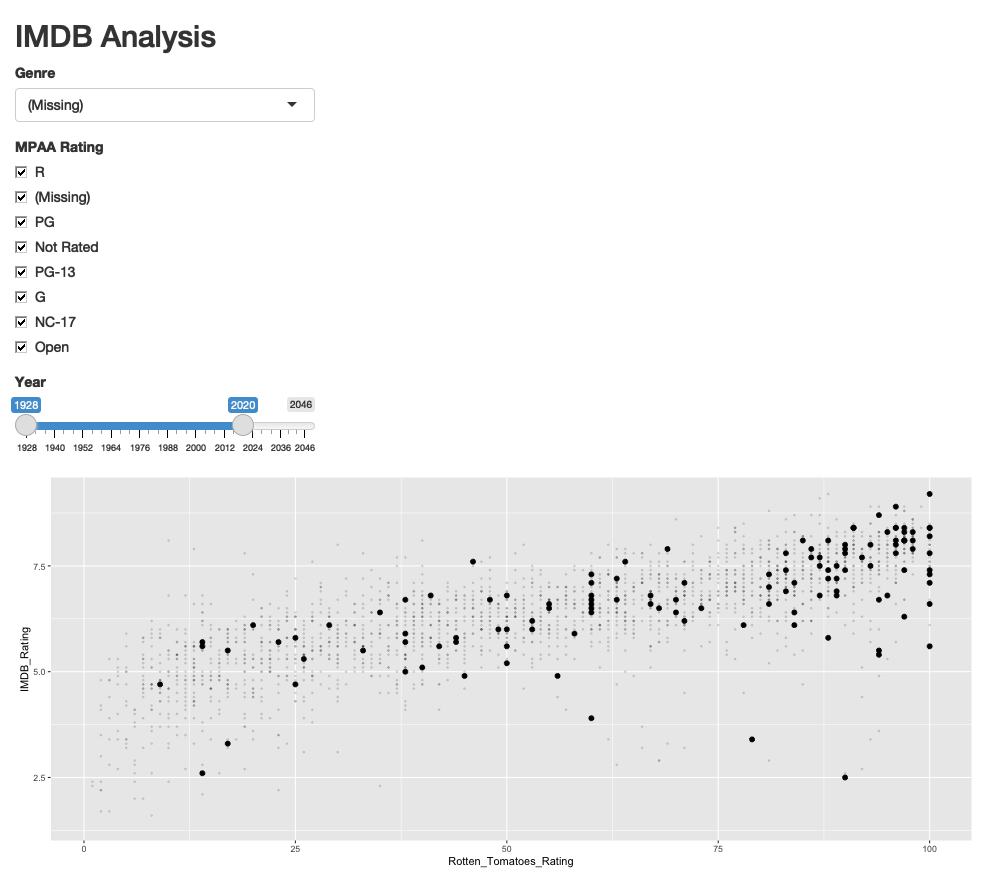

```{r, echo = FALSE}
library(knitr)
knitr::opts_chunk$set(cache = TRUE, message = FALSE, warning = FALSE, echo = TRUE, fig.height = 5, retina = 4)
```


_[Reading](), [Recording](),  [Rmarkdown]()_

1. So far, all of our Shiny applications have been based on toy simulated data.
In this set of notes, we'll use Shiny to explore a real dataset, illustrating
the general development workflow in the process. Before diving into code, let's
consider the role of interactivity in data analysis.

1. A major difference between doing visualization on paper and on computers is
that visualization on computers can make use of interactivity. An interactive
visualization is one that changes in response to user cues. This allows a
display to update in a way that provides a visual comparison that was not
available in a previous view. In this way, interactive visualization allows
users to answer a sequence of questions.

1. Selection, both of observations and of attributes, is fundamental to
interactive visualization. This is because it precedes other interactive
operations: you can select a subset of observations to filter down to or
attributes to coordinate across multiple displays (we consider both types of
interactivity in later lectures).

1. The code below selects movies to highlight based on Genre. We use a
`selectInput` to create the dropdown menu. A reactive expression creates a new
column (`selected`) in the `movies` dataset specifiying whether the current
movie is selected. The reactive graph structure means that the ggplot2 figure is
recreated each time the selection is changed, and the `selected` column is used
to shade in the points. This process of changing the visual encoding of
graphical marks depending on user selections is called "conditional encoding."

    ```{r code=readLines("apps/app1.R")}
    ```
    
    ```{r, echo = FALSE}
    appshot(app = "apps/app1.R", file = "app1.png", vheight = 400, delay=5)
    
    ```

1. We can extend this further. Let's allow the user to filter by year and MPAA
rating. Notice that there are some years in the future! We also find that there
are systematic differences in IMDB and Rotten Tomatoes ratings as a function of
these variables.

    ```{r code=readLines("apps/app2.R")}
    ```
    
    ```{r, echo = FALSE}
    appshot(app = "apps/app2.R", file = "app2.png", vheight = 400, delay=5)
    
    ```
    
1. These visualizations are an instance of the more general idea of using filtering to reduce complexity in data. Filtering is an especially powerful technique in the interactive paradigm, where it is possible to easily reverse (or compare) filtering choices.

Interpretation 2: Dynamic queries allow rapid evaluation of conditional probabilities. The visualization above was designed to answer: What is the joint distribution of movie ratings, conditional on being a drama?