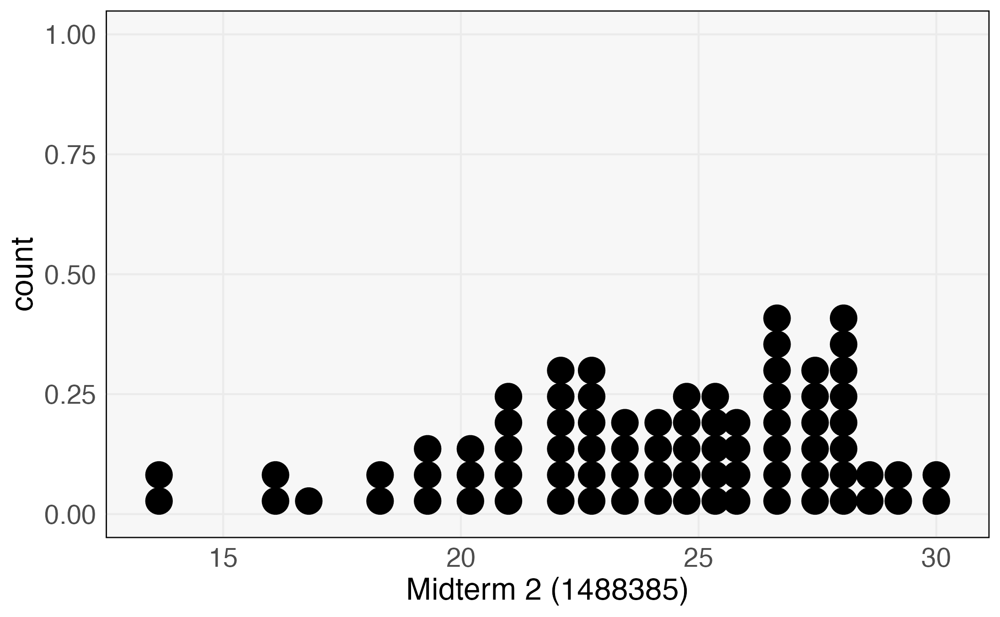
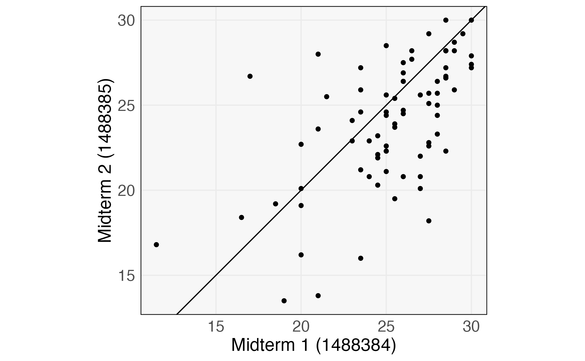

```{r, echo = FALSE, message = FALSE, warning = FALSE}
library(knitr)
library(tidyverse)
opts_chunk$set(echo = TRUE, message = FALSE, warning = FALSE, cache = TRUE, dpi = 200, fig.align = "center", out.width = 650, fig.height = 3, fig.width = 9)
th <- theme_minimal() + 
  theme(
    panel.grid.minor = element_blank(),
    panel.background = element_rect(fill = "#f7f7f7"),
    panel.border = element_rect(fill = NA, color = "#0c0c0c", size = 0.6),
    axis.text = element_text(size = 14),
    axis.title = element_text(size = 16),
    legend.position = "bottom"
  )
theme_set(th)
options(width = 100)
```
class: bottom

# Partial Dependence Plots (Part 1)

.pull-left[
  April 20, 2022
]

---

### Announcements

* Project peer reviews due tonight (April 20)
  - Mistake on PDF, and we will be flexible
* Plan for the remainder of the semester
  - Visualizing supervised models
  - Revising your projects and favorite portfolio

---

### Today

By the end of the class, you should be able to...

   * Generate and interpret Ceteris Paribus (CP) profiles associated with a
   trained nonlinear model
   * Generate and interpret Grouped CP profiles

---

### Exam Review

* Most difficulties were technical, not conceptual
* One stumbling block was interpretation for PCA
  - Components: These are derived, linear features that maximize variance
  - Scores: Each observation is a mixture of these derived features. Think of
  the scores as mixing weights.
  
---

.pull-left[
```{r, echo = FALSE}

```
]

.pull-right[
```{r, echo =FALSE}

```
]

---

## Live Coding Example

We will work through Exercise  [A Bikesharing Model] in Module 3.

---

### Exercise

* Exercise 12.1 [Gender Pay Gap] on Canvas
* Can discuss, but submit individually