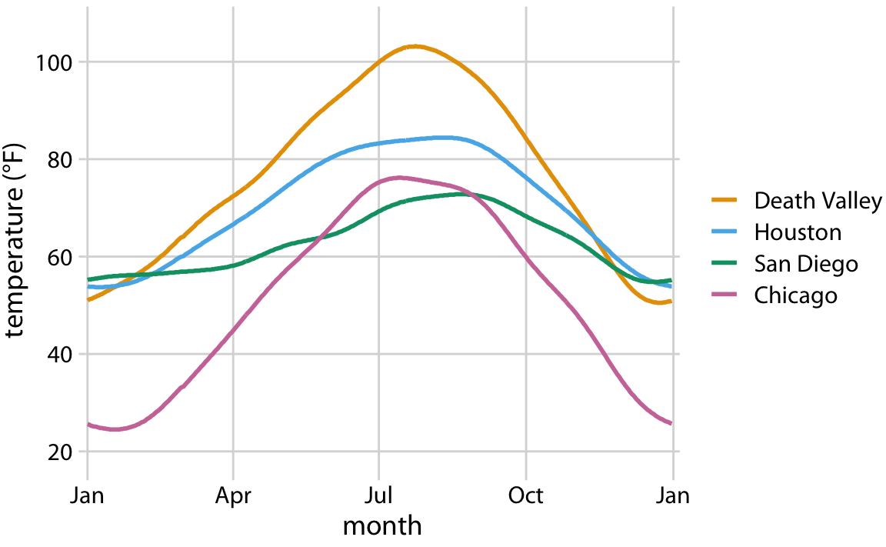
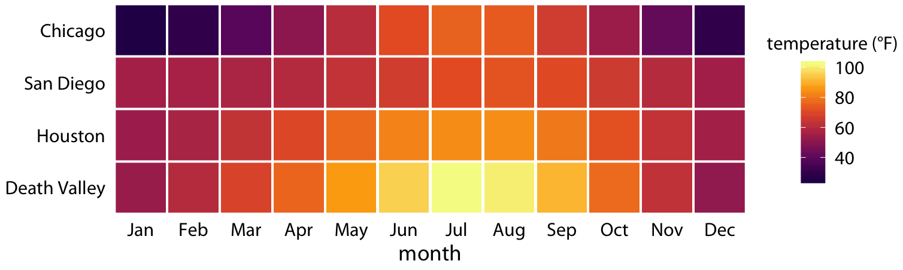
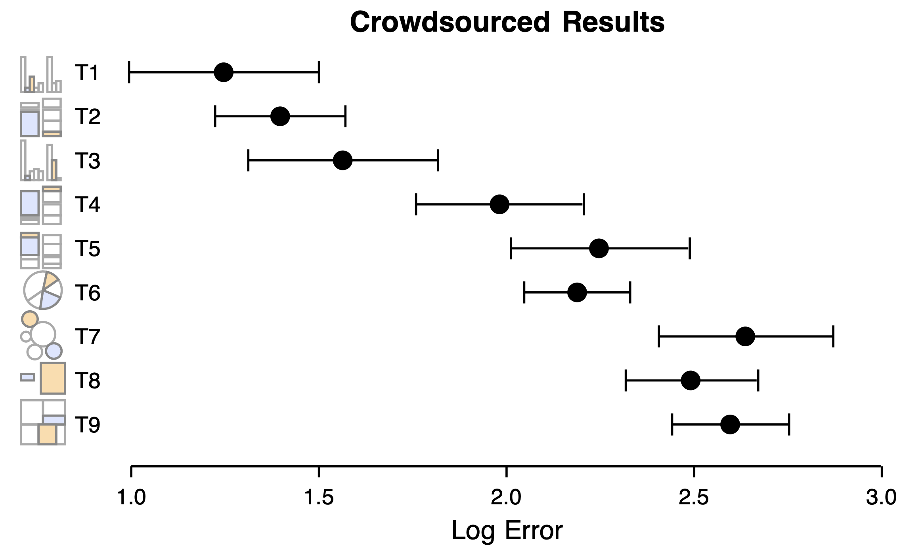
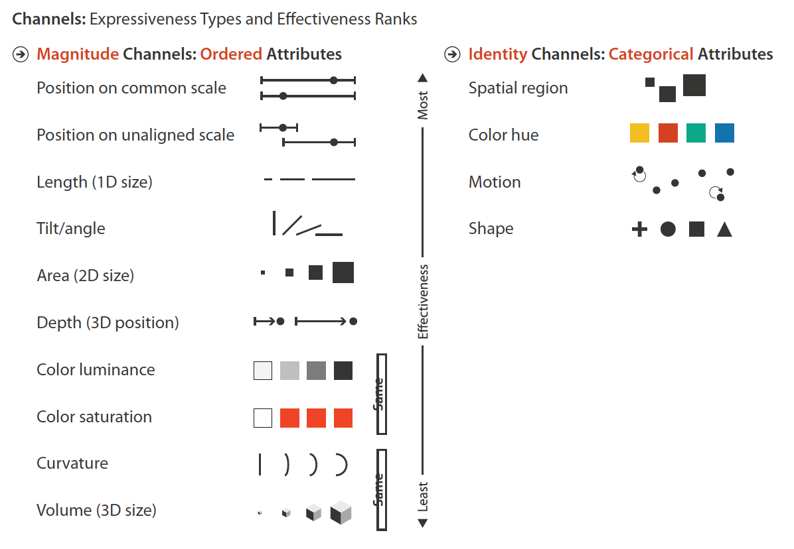
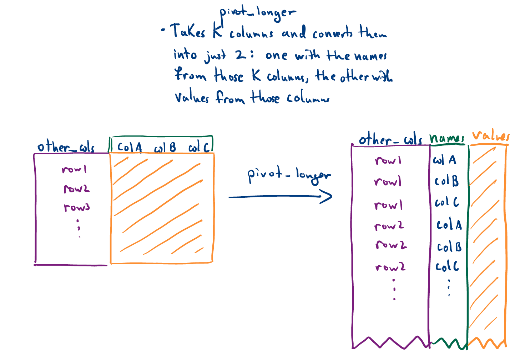
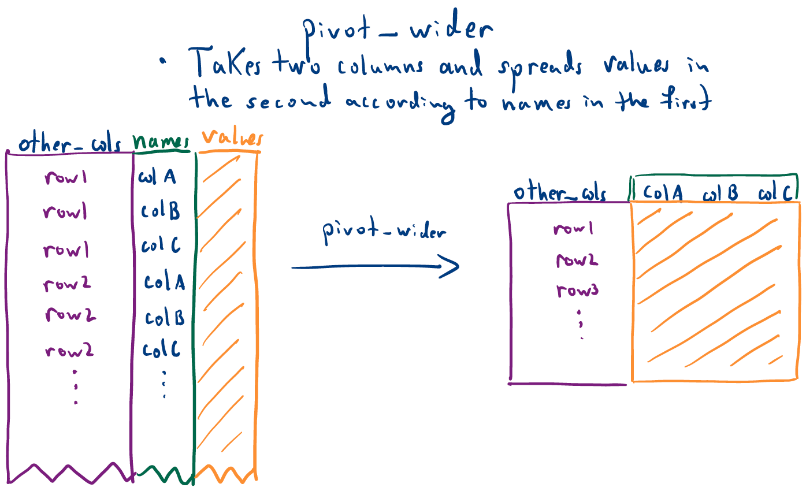
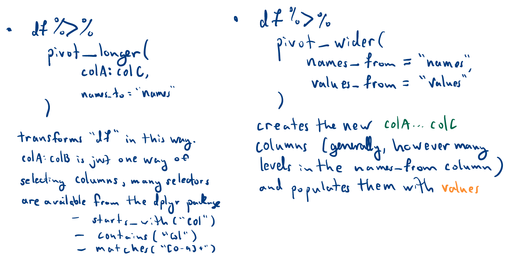
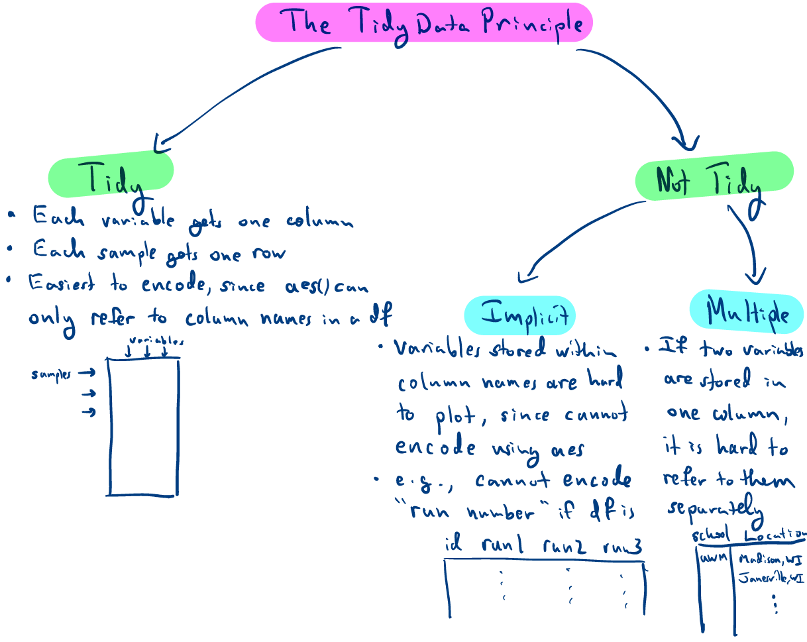

```{r, echo = FALSE}
library(knitr)
opts_chunk$set(echo = TRUE, message = FALSE, warning = FALSE, cache = T, dpi = 200, fig.align = "center", out.width = 650)
```
class: bottom

# Tidy Data and Pivoting

.pull-left[
January 31, 2022
]
 
---

## Exercise Review

---

a. Make a version of Figure 2.3 using a line mark (`geom_line`). Make at
least one customization of the theme to make the plot more similar to the
version in Figure 2.3. _Hint: To group the lines by city, use the `group = ` aesthetic mapping like in point (11) of the Week 1 [2] notes._

```{r, echo = FALSE}

```

---

Basic solution with theme.

```{r, fig.height = 3, fig.width = 5.5}
temperature <- read_csv("https://raw.githubusercontent.com/krisrs1128/stat479_s22/main/data/temperatures.csv")
ggplot(temperature) +
  geom_line(aes(date, temperature, col = city)) +
  theme_minimal()
```

---

### Issues

Encoding month averages loses information

.pull-left[
```{r, fig.height = 3, fig.width = 5.5}
temperature %>%
  group_by(city, month) %>%
  summarise(mean_temp = mean(temperature)) %>%
  ggplot() +
  geom_line(aes(month, mean_temp, group = city, col = city)) +
  theme_minimal()
```
]

.pull-right[
```{r, fig.height = 3, fig.width = 5.5}
ggplot(temperature) +
  geom_line(aes(date, temperature, col = city)) +
  theme_minimal()
```
]

---

### Issues

* `geom_smooth` with month is not the same as `geom_line`!

.pull-left[
```{r, fig.height = 3, fig.width = 5.5}
ggplot(temperature) +
  geom_line(aes(date, temperature, col = city)) +
  theme_minimal()
```
]
.pull-right[
```{r, fig.height = 3, fig.width = 5.5}
ggplot(temperature) +
  geom_smooth(aes(date, temperature, col = city)) +
  theme_minimal()
```
]

---

### Customizations

Some of you found the exact color scheme!
```{r, fig.height = 3, fig.width = 5.5, out.width = 600}
ggplot(temperature) +
  geom_line(aes(date, temperature, col = city)) +
  scale_color_manual(values = c("#019e73", "#56b4e9", "#e7a208", "#cc79a7")) +
  theme_minimal()
```

---

### Customizations
    
Formatting the date using `scale_x_date`
```{r, fig.height = 3, fig.width = 5.5, out.width = 600}
ggplot(temperature) +
  geom_line(aes(date, temperature, col = city)) +
  scale_x_date(date_labels = "%b") + 
  theme_minimal()
```

---

c. Using the data generated in (b), Make a version of Figure 2.4 using a
tile mark (`geom_tile`). Try either (i) adding the `scale_fill_viridis_c(option =
"magma")` scale to match the color scheme from the reading or (ii) adding
`coord_fixed()` to make sure the marks are squares, not rectangles.

```{r, echo = FALSE}

```

---

### Basic Solution

```{r, fig.width = 5.5, fig.height = 2}
averages <- temperature %>%
  group_by(city, month) %>%
  summarise(mean_temp = mean(temperature))

ggplot(averages) +
  geom_tile(aes(month, city, fill = mean_temp)) +
  scale_fill_viridis_c(option = "magma") +
  coord_fixed()
```

---

### Issues

* Some redundant code (e.g., in labeling or aesthetics)
* When using both color and fill encodings, apply the same scale transformations to both

```{r, fig.width = 5.5, fig.height = 3.5, out.width = 325}
ggplot(averages) +
  geom_tile(aes(month, city, fill = mean_temp, col = mean_temp)) +
  scale_fill_viridis_c(option = "magma") +
  coord_fixed()
```

---

### Customization

Generating date abbreviations with `month.abb`,

```{r, fig.width = 5.5, fig.height = 2}
ggplot(averages) +
  geom_tile(aes(month, city, fill = mean_temp)) +
  scale_x_discrete(labels = month.abb) +
  scale_fill_viridis_c(option = "magma") +
  coord_fixed()
```

---

### Customization

Generating date abbreviations with `month()` function.

```{r, fig.width = 5.5, fig.height = 2, out.width = 500}
library(lubridate)
averages <- temperature %>%
  group_by(new_month = month(date, label = TRUE), city) %>%
  summarise(mean_temp = mean(temperature))
ggplot(averages) +
  geom_tile(aes(new_month, city, fill = mean_temp)) +
  scale_fill_viridis_c(option = "magma") +
  coord_fixed()
```

---

### Customization

Re-ordering by average temperature,

```{r, fig.width = 5.5, fig.height = 2}
ggplot(averages) +
  geom_tile(aes(new_month, reorder(city, mean_temp, mean), fill = mean_temp)) +
  labs(x = "month", y = "city") +
  scale_fill_viridis_c(option = "magma") +
  coord_fixed()
```

---

### Customization

Labeling with degree symbol, adding white borders, removing background.

```{r, fig.width = 6.5, fig.height = 2}
ggplot(averages) +
  geom_tile(aes(new_month, city, fill = mean_temp), col = "white", lwd = 0.5) +
  scale_fill_viridis_c(option = "magma") +
  coord_fixed() +
  theme_minimal() + theme(axis.ticks = element_blank(), panel.grid = element_blank()) +
  labs(x = "month", fill = "mean temperature (°F)")
```

---
d. Compare and contrast the two displays. What types of comparisons are
easier to make / what patterns are most readily visible using Figure 2.3 vs.
Figure 2.4, and vice versa?

---

How accurate were comparisons using different encodings?

```{r, echo = FALSE, out.width = 700}

```

Figure 4 from Bostock and Heer's "Crowdsourcing Graphical Perception: Using
Mechanical Turk to Assess Visualization Design"

---

Figure 5.4 from Munzner's _Visualization Analysis and Design_.

```{r, echo = FALSE, out.width = 800}

```

---

### Poll

Exercise submission preference: [https://tinyurl.com/4javzuyu](https://tinyurl.com/4javzuyu)

---

## Notes Review

---
```{r, echo = FALSE, out.width =900}

```
---
```{r, echo = FALSE, out.width = 900}

```
---
```{r, echo = FALSE, out.width = 900}

```
---
```{r, echo = FALSE, out.width = 700}

```
---

### Exercise [Plant Growth Experiment]

The data describe the height of several plants measured every 7 days. The plants
have been treated with different amounts of a growth stimulant. The first few
rows are printed below -- `height.x` denotes the height of the plant on day `x`.
    
```{r}
plants <- read_csv("https://uwmadison.box.com/shared/static/qg9gwk2ldjdtcmmmiropcunf34ddonya.csv")
plants
```

---

### Exercise [Plant Growth Experiment]
  
a. Propose an alternative arrangement of rows and columns that conforms to the
tidy data principle.

b. Implement your proposed arrangement from part (a).

Bonus 1: Using the dataset from (b), design and implement a visualization
showing the growth of the plants over time according to different treatments.

Bonus 2: Can you think of another way of selecting columns for part (a)?
    
---

### Exercise Hints

* It looks like the plants are growing over time, but time is not a column in the dataset
* `starts_with()` selects all columns starting with a phrase, e.g.,

```{r}
iris %>%
  select(starts_with("Petal"))
```


---

### Exercise

* Exercise 2.1 on Canvas
* Can discuss with partner, but submit own solution
* Until:
