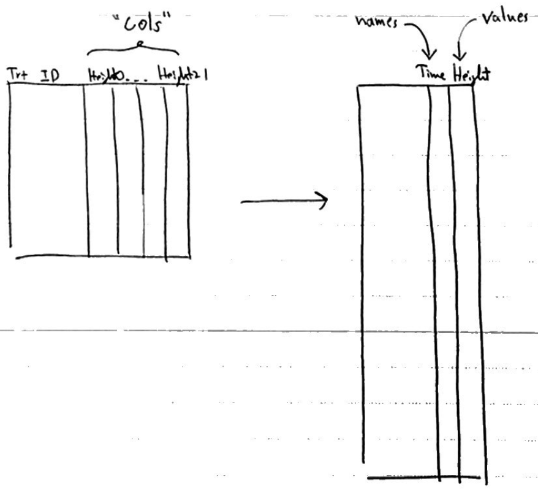

```{r, echo = FALSE, message = FALSE}
library(knitr)
library(tidyverse)
opts_chunk$set(echo = TRUE, message = FALSE, warning = FALSE, cache = FALSE, dpi = 200, fig.align = "center", out.width = 650)
th <- theme_minimal() + 
  theme(
    panel.grid.minor = element_blank(),
    panel.background = element_rect(fill = "#f7f7f7"),
    panel.border = element_rect(fill = NA, color = "#0c0c0c", size = 0.6),
    axis.text = element_text(size = 14),
    axis.title = element_text(size = 16),
    legend.position = "bottom"
  )
theme_set(th)
options(width = 100)
```
class: bottom

# Tidy Data and Pivoting

.pull-left[
February 2, 2022
]
 
---

### Announcements

* Please upload your compiled code
* Group formation deadline is this weekend
 
---

## Exercise Review

---

The data describe the height of several plants measured every 7 days. The plants
have been treated with different amounts of a growth stimulant. The first few
rows are printed below -- `height.x` denotes the height of the plant on day `x`.

a. Propose an alternative arrangement of rows and columns that conforms to the
tidy data principle.

b. Implement your proposed arrangement from part (a).

---

### Part (a)

The issue is that the dates at which the plants were measured (0 days, 7 days, )
is being stored in the column names, rather than being explicitly stored in a
variable. We need to turn the 4 columns containing height measurements into two
columns: observation time and plant height.

```{r}
library(tidyverse)
plants <- read_csv("https://uwmadison.box.com/shared/static/qg9gwk2ldjdtcmmmiropcunf34ddonya.csv")
head(plants)
```
---

### Part (a)

I encourage you have pen and paper nearby when writing code. Here is an example
sketch,


```{r, echo = FALSE, out.width = 450}

```

---

### Be mindful of context

Many solutions called the first column "height." But the numbers indicate time
-- the second column is the height of the plant.

```{r, echo = FALSE, out.width = 450}

```


---

### Part (b)

Here is one way to reshape the data.

```{r}
plants %>%
  pivot_longer(
    c("height.0", "height.7", "height.14", "height.21"),
    names_to = "time",
    values_to = "height"
  )
```

---

There are a few approaches that are more concise, though.

.pull-left[
```{r}
plants %>%
  pivot_longer(
    height.0:height.21,
    names_to = "time",
    values_to = "height"
  )
```
]

.pull-right[
```{r}
plants %>%
  pivot_longer(
    starts_with("height"),
    names_to = "time",
    values_to = "height"
  )
```
]

---

Yet more approaches,

```{r}
plants %>%
  pivot_longer(
    !(plantid | treatment),
    names_to = "time",
    values_to = "height"
  )
```


```{r}
plants %>%
  pivot_longer(
    num_range("height.", 0:21),
    names_to = "time",
    values_to = "height"
  )
```


---

### Bonus

When making the plot, beware that the `plantid` column refers to different
plants, depending on which treatment group it was in!
  - It is not ideal, but this happens frequently in real data
  
```{r}
plants_longer <- plants %>%
  pivot_longer(
    height.0:height.21,
    names_to = "time",
    values_to = "height"
  )
```

---

### Bonus

* `interaction()` is used to group lines by combinations of variables
* `height.7` comes after `height.21` (sorting character data)
* We will address this today's material

```{r, fig.width = 6, fig.height = 2.5}
ggplot(plants_longer) +
  geom_line(aes(time, height, group = interaction(plantid, treatment), col = treatment))
```

---

## Notes Review

(go to [link](https://drive.google.com/file/d/1HueTCy6mnQYb5dg9vbphztpywNDMYPOG/view?usp=sharing))

---

Let's use these ideas to plot the plant data.

```{r, fig.width = 6, fig.height = 2.5}
plants_longer %>%
  separate(time, c("prefix", "time"), convert = TRUE) %>%
  ggplot() +
    geom_line(aes(time, height, group = interaction(plantid, treatment), col = treatment))
```

---
Let's use these ideas to plot the plant data.

```{r, fig.width = 6, fig.height = 2.5}
plants_longer %>%
  mutate(
    time = str_remove(time, "height."), # string manipulation
    time = as.integer(time) # type conversion
  ) %>%
  ggplot() +
    geom_line(aes(time, height, group = interaction(plantid, treatment), col = treatment))
```

---

Let's use these ideas to plot the plant data.

```{r, fig.width = 6, fig.height = 2.5}
plants_longer %>%
  mutate(
    time = factor(time, levels = paste0("height.", seq(0, 21, 7))) # factor recoding
  ) %>%
  ggplot() +
    geom_line(aes(time, height, group = interaction(plantid, treatment), col = treatment))
```

---

This operation is so common, it's built-into `pivot_longer`,

```{r, fig.width = 6, fig.height = 2.5}
plants %>%
  pivot_longer(
    starts_with("height"), names_sep = "\\.", 
    names_to = c("prefix", "time"), 
    names_transform = list(time = as.integer) ,
    values_to = "height"
  ) %>%
  ggplot() +
    geom_line(aes(time, height, group = interaction(plantid, treatment), col = treatment))
```

---

### Exercise [Olympics Derivations]

a. Create new columns for the city and country of birth for each athlete in the
London 2012 Olympics
[dataset](https://uwmadison.box.com/s/rzw8h2x6dp5693gdbpgxaf2koqijo12l).

b. Compute the standard deviation of athlete age within each sport. Which sport
has widest SD in age?

c. Make a visualization of sports against participant age. Sort sports by
age variance.

```{r}
olympics <- read_csv("https://uwmadison.box.com/shared/static/rzw8h2x6dp5693gdbpgxaf2koqijo12l.csv")
```

Also answer: What do you feel is your "muddiest point" related to pivoting or
deriving variables?
  
---

### Exercise Hints

* To select a column name that has spaces in it, use tick marks, e.g.,

```{r}
data_frame("name with spaces" = c(1, 2, 3), "another_col" = c(2, 3, 4)) %>%
  select(`name with spaces`)
```


* To sort a `data.frame` by a variable, use `arrange`

```{r}
iris %>%
  arrange(-Petal.Length) # decreasing. Remove "-" for increasing
```

---

### Hints Continued

* To prevent overplotting, you can jitter the position,

```{r, fig.width = 6, fig.height = 3}
ggplot(iris) +
  geom_point(aes(Sepal.Length, Species), position = position_jitter(h = 0.1))
```


---

### Exercise

* Exercise 2.2 on Canvas
* Can discuss with partner, but submit own solution
* Until:
