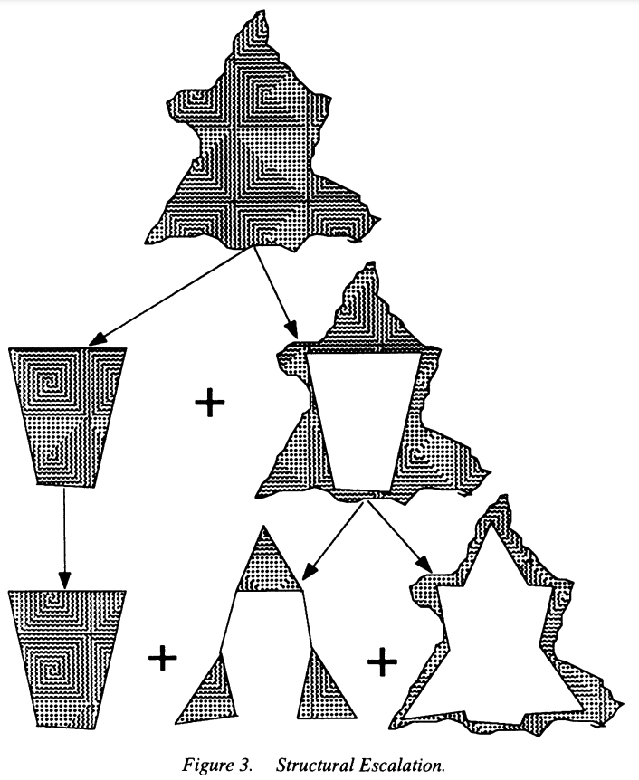

```{r, echo = FALSE, message = FALSE, warning = FALSE}
library(knitr)
library(tidyverse)
opts_chunk$set(echo = TRUE, message = FALSE, warning = FALSE, cache = TRUE, dpi = 200, fig.align = "center", out.width = 650)
th <- theme_minimal() + 
  theme(
    panel.grid.minor = element_blank(),
    panel.background = element_rect(fill = "#f7f7f7"),
    panel.border = element_rect(fill = NA, color = "#0c0c0c", size = 0.6),
    axis.text = element_text(size = 14),
    axis.title = element_text(size = 16),
    legend.position = "bottom"
  )
theme_set(th)
options(width = 100)
```
class: bottom

# Ridge Plots Review

.pull-left[
February 9, 2022
]
 
---

### Announcements

* Project Milestone 1 due Sunday evening
 
---

### Exercise 3.1 Discussion

```{r}
library(tidyverse)
pokemon <- read_csv("https://uwmadison.box.com/shared/static/hf5cmx3ew3ch0v6t0c2x56838er1lt2c.csv")
```

---

One approach is to plot Pokemon by their Attack-to-Defense ratio.

```{r, fig.height = 8, fig.width= 15}
pokemon <- pokemon %>%
  mutate(attack_to_defense = Attack / Defense)

ggplot(pokemon) +
  geom_point(aes(attack_to_defense, reorder(Name, attack_to_defense))) +
  facet_grid(type_1 ~ ., scales = "free_y", space = "free") +
  theme(strip.text.y = element_text(angle = 0, size = 18))
```

---

One nice trick is to use `facet_grid_paginate` to split the facets across
several plots.

```{r, fig.height = 8, fig.width= 15}
library(ggforce)
ggplot(pokemon %>% filter(type_1 %in% c("Bug", "Dark", "Dragon", "Electric"))) +
  geom_point(aes(attack_to_defense, reorder(Name, attack_to_defense))) +
  facet_grid_paginate(type_1 ~ ., ncol = 1, nrow = 2, scales = "free_y") +
  theme(strip.text.y = element_text(angle = 0, size = 18))
```

---

This is the same, except I changed `page` to 2.

```{r, fig.height = 8, fig.width= 15}
ggplot(pokemon) +
  geom_point(aes(attack_to_defense, reorder(Name, attack_to_defense))) +
  facet_grid_paginate(type_1 ~ ., ncol = 1, nrow = 2, page = 2, scales = "free_y") +
  theme(strip.text.y = element_text(angle = 0, size = 18))
```


---

Alternatively, we can plot these two scores against one another in a
scatterplot (what are the trade-offs?).

```{r, fig.height = 5.5, fig.width = 10}
ggplot(pokemon) +
  geom_abline(slope = 1, col = "#d3d3d3", size = .5) +
  geom_point(aes(Defense, Attack)) +
  facet_wrap(~ type_1)
```

---

We can reorder the facets by releveling the `type_1` factor according to the
median Attack-to-Defense ratio. 

```{r}
type_1_order <- pokemon %>%
  group_by(type_1) %>%
  summarise(med_ad = median(attack_to_defense)) %>%
  arrange(med_ad) %>%
  pull(type_1)

pokemon2 <- pokemon %>%
  mutate(type_1 = factor(type_1, levels = type_1_order))
```

---

```{r, fig.height = 6, fig.width = 10}
ggplot(pokemon2) +
  geom_abline(slope = 1, col = "#d3d3d3", size = .5) +
  geom_point(aes(Defense, Attack)) +
  facet_wrap(~ type_1)
```

---

Alternatively, we can directly use the `reorder()` function within `facet_wrap`.

```{r, fig.height = 6, fig.width = 10}
ggplot(pokemon) +
  geom_abline(slope = 1, col = "#d3d3d3", size = .5) +
  geom_point(aes(Defense, Attack)) +
  facet_wrap(~ reorder(type_1, attack_to_defense, median))
```

---

This labels a subset with very low or high `attack_to_defense`.

```{r, fig.height = 6, fig.width = 10, eval = FALSE}
library(ggrepel)
ggplot(pokemon, aes(Defense, Attack)) +
  geom_abline(slope = 1, col = "#d3d3d3", size = .5) +
  geom_point(aes(Defense, Attack, col = Legendary)) +
  geom_text_repel(
    data = pokemon %>% filter(abs(log(attack_to_defense)) > 1), 
    aes(label = Name)
    ) +
  facet_wrap(~ reorder(type_1, attack_to_defense, median), ncol = 6)
```

---

```{r, fig.height = 6, fig.width = 10, echo = FALSE}
library(ggrepel)
ggplot(pokemon, aes(Defense, Attack)) +
  geom_abline(slope = 1, col = "#d3d3d3", size = .5) +
  geom_point(aes(Defense, Attack, col = Legendary)) +
  geom_text_repel(data = pokemon %>% filter(abs(log(attack_to_defense)) > 1), aes(label = Name), size = 2) +
  scale_color_manual(values = c("#49896F", "#B74555")) +
  facet_wrap(~ reorder(type_1, attack_to_defense, median), ncol = 6)
```

Colors from the bulbasaur [color palette](https://www.schemecolor.com/bulbasaur-pokemon-colors.php)...

---

## Muddiest Points

---

### Learning about functions

If you run into a function `f` that is confusing, useful helpers are,

* `?f` or `help(f)` pulls up the help page
* `example(f)` runs a few examples

If we want an extended example from a package, we can use `browseVignettes("packageName")`.

```{r}
?facet_grid_paginate
example(facet_grid_paginate)
```


---

### What does `reorder()` actually do?

```{r}
df <- data.frame(
  x = factor(c("a", "a", "b")), 
  y = 3:1
  )
levels(df$x)
```

---

### What does `reorder()` actually do?

Though it doesn't explicitly reorder rows, it changes the levels of the
associated factors.

```{r}
df$x <- reorder(df$x, df$y)
levels(df$x)
```

---

### When to use pivot_wider?

This is an example from `example(pivot_wider)`

```{r}
us_rent_income
```

---

```{r}
us_rent_income %>%
  pivot_wider(names_from = variable, values_from = c("estimate", "moe"))
```

---

### How to plan a visualization analysis?

There are many questions around the themes of,

* How can we know which types of new variables to derive?
* How do we identify the interesting plots for a given dataset?
* When will know whether a plot is done?

---

### Tips

.pull-left[
* Use visualization to identify main sources of variation
* Use visualization to evaluate implicit assumptions (null hypotheses)
* Think of a visualization as more like an essay than a program
]

---

### Tips

.pull-left[
* **Use visualization to identify main sources of variation**
* Use visualization to evaluate implicit assumptions (null hypotheses)
* Think of a visualization as more like an essay than a program
]

.pull-right[
```{r, echo = FALSE, out.width = 400}

```
]

---

### Tips

.pull-left[
* Use visualization to identify main sources of variation
* **Use visualization to evaluate implicit assumptions (null hypotheses)**
* Think of a visualization as more like an essay than a program
]

.pull-right[
"The age ranges for all Olympics sports are about the same."
]

---

### Tips

.pull-left[
* Use visualization to identify main sources of variation
* Use visualization to evaluate implicit assumptions (null hypotheses)
* **Think of a visualization as more like an essay than a program**
]

.pull-right[
Good essays benefit from iterative refinement.
]

---

### Notes Review

(go to [link](https://drive.google.com/file/d/1snowl_dTLG8QJviHH8qA48dxzUfGlYDO/view?usp=sharing))

---

### Exercise 3.2

Prepare two slides describing the main context and workflow for your project.
You will share feedback with one other team at the end of class.

.pull-left[
Context

* Problem: What is the main problem that you would like to study? Who is your
audience?
* References: From what sources do you draw inspiration? If you do not know many
relevant materials, how do you plan on finding more references?
]

.pull-right[
Workflow

* Questions: Based on the tips above, what question might you start with?
* Implementation: How will you organize readings, code, and writing?
* Values: What do you strive for individually and as a team?
]

---

### Exercise

* Exercise 3.2 on Canvas
* Prepare with project groups: 
* Discuss with a team (listed on Canvas): 
