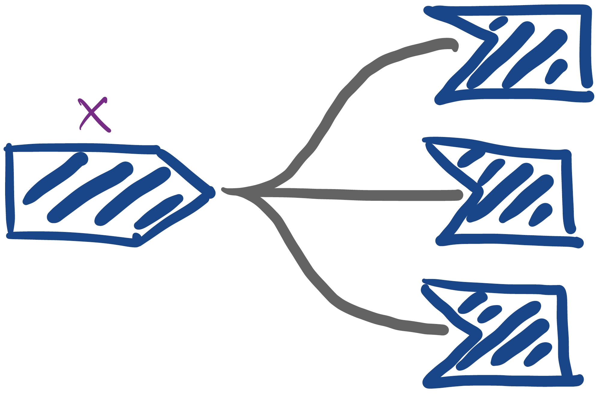
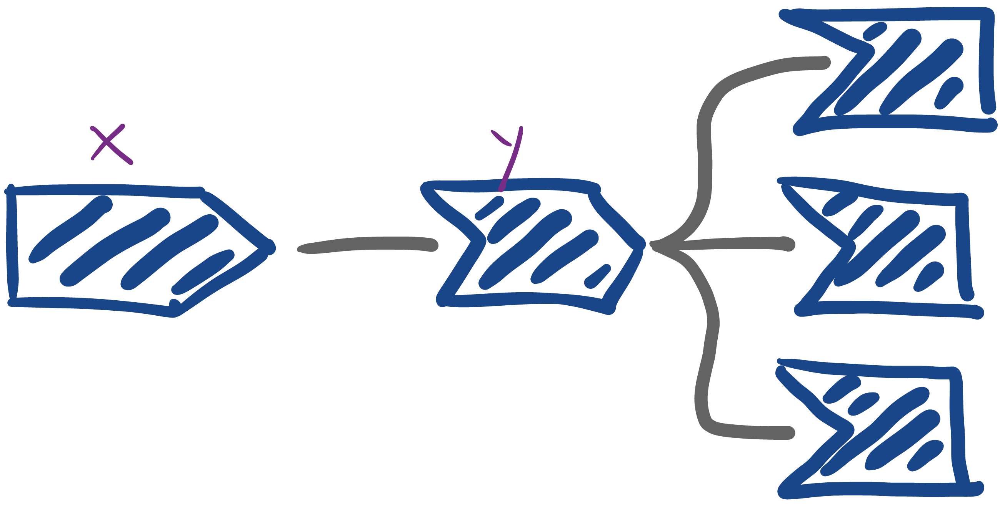
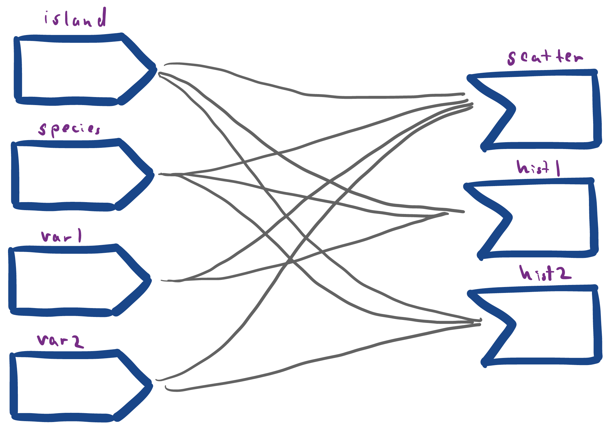
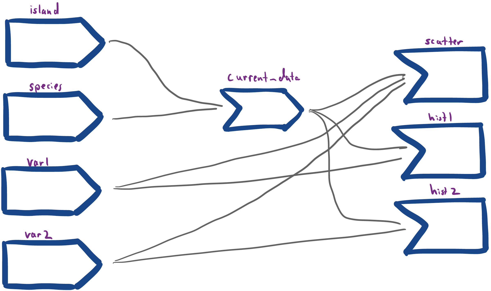

```{r, echo = FALSE, message = FALSE, warning = FALSE}
library(knitr)
library(webshot)
library(tidyverse)
opts_chunk$set(echo = TRUE, message = FALSE, warning = FALSE, cache = TRUE, dpi = 200, fig.align = "center", out.width = 650)
th <- theme_minimal() + 
  theme(
    panel.grid.minor = element_blank(),
    panel.background = element_rect(fill = "#f7f7f7"),
    panel.border = element_rect(fill = NA, color = "#0c0c0c", size = 0.6),
    axis.text = element_text(size = 14),
    axis.title = element_text(size = 16),
    legend.position = "bottom"
  )
theme_set(th)
options(width = 100)
```
class: bottom

# Reactivity in Real Applications

.pull-left[
February 16, 2022
]
 
---

### Announcements

* Portfolio Exercises are due Sunday
  
---

### Today

* Build more familiarity with reactivity graphs
* Experiment with how interactivity is useful on real-world data
* Be able to explain when interactivity helps

---

## Exercise 4.2 Discussion

---

### Option 1a

```{r, eval = FALSE}
library(shiny)

ui <- fluidPage(
  titlePanel("Calculator"),
  numericInput("x", "Enter the value of x", 0),
  textOutput("f1"),
  textOutput("f2"),
  textOutput("f3")
)

server <- function(input, output) {
  output$f1 <- renderText({ 3 * input$x ^ 2 + 3})
  output$f2 <- renderText({ sqrt(3 * input$x ^ 2 + 3) - 5})
  output$f3 <- renderText({ 30 * input$x ^ 2 + 30})
}
    
shinyApp(ui, server)
```

---

### Option 1a

```{r, echo = FALSE}

```
  
---

### Option 1a

.pull-left[
```{r, eval = FALSE}
library(shiny)

ui <- fluidPage(
  titlePanel("Calculator"),
  numericInput("x", "Enter the value of x", 0),
  textOutput("f1"),
  textOutput("f2"),
  textOutput("f3")
)

server <- function(input, output) {
  y <- reactive(3 * input$x ^ 2 + 3)
  output$f1 <- renderText(y())
  output$f2 <- renderText(sqrt(y()) - 5)
  output$f3 <- renderText(10 * y())
}
    
shinyApp(ui, server)
```
]

.pull-right[
```{r, echo = FALSE}

```
]

---

### Option 1b

.pull-left[
* [Initial code](https://drive.google.com/file/d/1a7480Lnz-ercMr0SFYIOBUbyU07P1L1g/view?usp=sharing)
* [Revision](https://drive.google.com/file/d/1C1E3u3pcwv07I-fcPio02QHtEZZnIiEu/view?usp=sharing)
* [Final](https://drive.google.com/file/d/1SQsqqJNmOKwcItCn1kBjjM8Bk8dgM3BB/view?usp=sharing)
]

.pull-right[
```{r, echo = FALSE}

```

]

---

### Option 1b

.pull-left[
* [Initial code](https://drive.google.com/file/d/1a7480Lnz-ercMr0SFYIOBUbyU07P1L1g/view?usp=sharing)
* [Revision](https://drive.google.com/file/d/1C1E3u3pcwv07I-fcPio02QHtEZZnIiEu/view?usp=sharing)
* [Final](https://drive.google.com/file/d/1SQsqqJNmOKwcItCn1kBjjM8Bk8dgM3BB/view?usp=sharing)
]

.pull-right[
```{r, echo = FALSE}

```

]


---

### Notes review

(go to [link](https://drive.google.com/file/d/1hkF4oWcVxyohBvH6JMpYdMvtJYHoaBev/view?usp=sharing))

---

## Exercise

---

### Options

Using Shiny on real data: California Wildfires [Module 1, Problem 14]

* Work with your project team (one submission per group)
* Upload (1) your code and (2) a screen recording
* Boilerplate code is provided on Canvas Hint
* Example app, to spark ideas

Bonus: Use `shinythemes` or `bslib` to customize the appearance.

---

### Exercise

* Exercise 4.3 on Canvas
* Until 2pm, then share with neighboring team
* Submit solutions as a team

