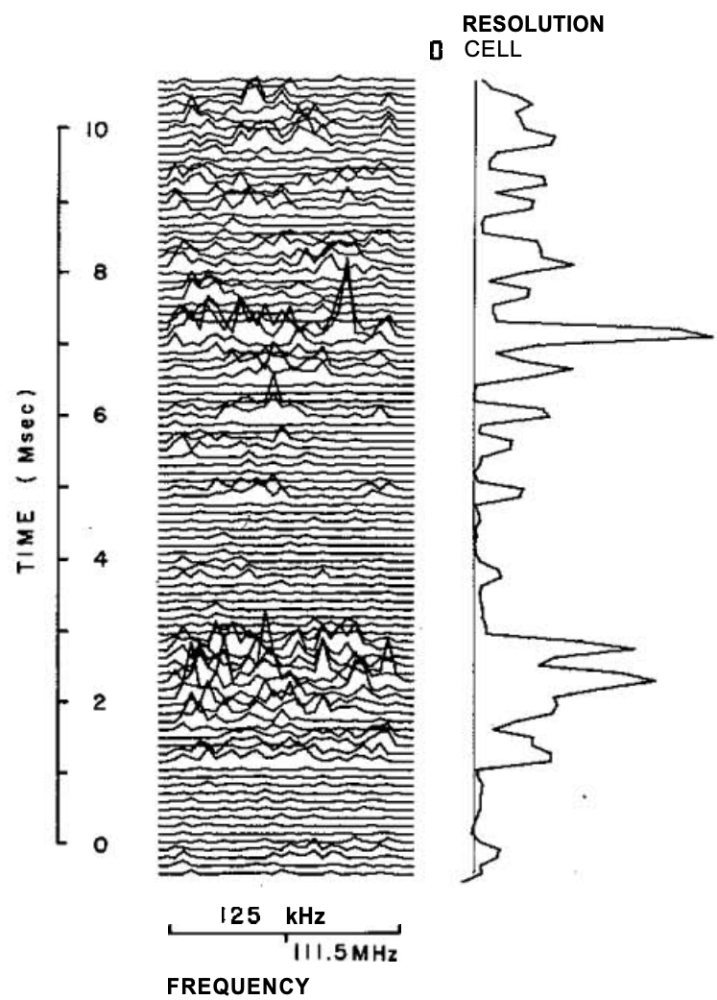

```{r, echo = FALSE, message = FALSE, warning = FALSE}
library(knitr)
library(tidyverse)
opts_chunk$set(echo = TRUE, message = FALSE, warning = FALSE, cache = TRUE, dpi = 200, fig.align = "center", out.width = 650)
th <- theme_minimal() + 
  theme(
    panel.grid.minor = element_blank(),
    panel.background = element_rect(fill = "#f7f7f7"),
    panel.border = element_rect(fill = NA, color = "#0c0c0c", size = 0.6),
    axis.text = element_text(size = 14),
    axis.title = element_text(size = 16),
    legend.position = "bottom"
  )
theme_set(th)
options(width = 100)
```
class: bottom

# Introduction to Shiny

.pull-left[
February 14, 2022
]
 
---

### Announcements

* Project Portfolio due Sunday evening
  - Multiple `ggplot` calls OK if in `patchwork` plot
* Midterm 1 in two weeks
  - In class and on paper
  - 1 page handwritten cheatsheet allowed
  - Will share practice exam next Monday
 
---

## Exercise 3.3 Discussion

---

### a

```{r, fig.height = 7, fig.width = 12.5}
library(tidyverse)
library(ggridges)
traffic <- read_csv("https://uwmadison.box.com/shared/static/x0mp3rhhic78vufsxtgrwencchmghbdf.csv")
ggplot(traffic) +
  geom_ridgeline(aes(date, name, height = value))
```

---

### a 

```{r, fig.height = 7, fig.width = 12.5}
ggplot(traffic) +
  geom_ridgeline(aes(date, reorder(name, value), height = value))
```

---

### b

.pull-left[
* Morning rush hour seems to be more concentrated than evening rush hour
* For cities with more traffic overall, rush hour begins earlier and ends later
* Groß Ipenner and Oldenburg (Holstein) don't seem to have two modes
* There is no sharp clustering across traffic rates
]

.pull-right[
```{r, fig.height = 7, fig.width = 12.5}
ggplot(traffic) +
  geom_ridgeline(aes(date, reorder(name, value), height = value))
```
]

---

### c

```{r, fig.height = 7, fig.width = 12.5}
ggplot(traffic) +
  geom_line(aes(date, value, group = name))
```

---

```{r, fig.height = 7, fig.width = 12.5}
ggplot(traffic) +
  geom_tile(aes(date, reorder(name, value), fill = value)) +
  scale_fill_viridis_c(option = "magma") +
  scale_x_datetime(expand = c(0, 0))
```

---

```{r, fig.height = 8, fig.width = 11.5}
ggplot(traffic) +
  geom_line(aes(date, value)) +
  facet_wrap(~ reorder(name, -value))
```

---

### Common Issues

Avoiding encoding city name by color. It is nearly impossible to distinguish
colors when there are so many.

```{r, fig.height = 7, fig.width = 14.5}
ggplot(traffic) +
  geom_ridgeline(aes(date, reorder(name, value), height = value, fill = name)) +
  theme(legend.position = "left")
```

---

### Interesting Ideas

Rescaling heights within each city.

```{r, fig.height = 8, fig.width = 10, eval = FALSE}
traffic <- traffic %>%
  group_by(name) %>%
  mutate(
    scaled_value = value / sum(value),
    average_value = mean(value)
  )

ggplot(traffic, aes(date, reorder(name, value))) +
  geom_ridgeline(aes(height = scales::rescale(scaled_value), fill = average_value), size = 0.1) +
  scale_fill_distiller(palette = "Purples", direction = 1) +
  theme(legend.position = "right")
```
---

### Interesting Ideas

Rescaling heights within each city.

```{r, fig.height = 8, fig.width = 10.5, echo = FALSE, out.width = 600}
traffic <- traffic %>%
  group_by(name) %>%
  mutate(
    scaled_value = value / sum(value),
    average_value = mean(value)
  )

ggplot(traffic, aes(date, reorder(name, value))) +
  geom_ridgeline(aes(height = scales::rescale(scaled_value), fill = average_value), size = 0.1) +
  scale_fill_distiller(palette = "Purples", direction = 1) +
  theme(legend.position = "right")
```

---

### Why ever use ridgelines?

.pull-left[
* Useful when we have many similar distributions that we would like to view very
close to one another.
* Less eye movement compared to faceted plots
]

.pull-right[
```{r, echo = FALSE, out.width = 350}

```

]

---

### 3.3 Option 2

```{r}
weather <- read_csv("https://raw.githubusercontent.com/krisrs1128/stat479_s22/main/exercises/data/weather.csv") %>%
  mutate(day_in_year = lubridate::yday(date)) %>%
  group_by(location, day_in_year) %>%
  summarise(across(precipitation:wind, mean))
```

---

### a

```{r, fig.width = 10, fig.height = 5}
p <- list()
p[["ribbon"]] <- ggplot(weather) +
  geom_ribbon(aes(day_in_year, ymin = temp_min, ymax = temp_max, fill = location), alpha = 0.8) +
  scale_x_continuous(expand = c(0, 0))
p[["ribbon"]]
```

---

### a

```{r, fig.width = 10, fig.height = 5}
p[["precip"]] <- ggplot(weather) +
  geom_point(aes(day_in_year, precipitation, col = location, size = wind)) +
  scale_x_continuous(expand = c(0, 0)) +
  scale_y_continuous(expand = c(0, 0, 0.1, 0)) +
  scale_size_continuous(range = c(0.1, 4))
p[["precip"]]
```

---

### a

```{r, fig.width = 8, fig.height = 4.5, out.width = 550}
p[["range"]] <- ggplot(weather) +
  geom_histogram(
    aes(temp_max - temp_min, fill = location), 
    alpha = 0.8, position = "identity"
  ) +
  scale_y_continuous(expand = c(0, 0, 0.1, 0))
p[["range"]]
```

---

```{r, fig.width = 16, fig.height = 8, out.width = 900}
library(patchwork)
p[["range"]] + (p[["ribbon"]] / p[["precip"]])
```
---

```{r, fig.width = 16, fig.height = 8}
p[["range"]] <- p[["range"]] +
  labs(x = "Temperature Range", title = "a")
p[["ribbon"]] <- p[["ribbon"]] +
  labs(x = "Day of Year", y = "Temperature", title = "b")
p[["precip"]] <- p[["precip"]] + 
  labs(x = NULL, title = "c") +
  scale_color_discrete(guide = FALSE)
p[["range"]] + (p[["ribbon"]] / p[["precip"]]) +
  plot_layout(guides = "collect", widths = c(1, 3))
```

---

### Notes review

(go to [link](https://drive.google.com/drive/folders/1ok45OKAnbEWxm5RdYRHZ9R_yqmgJepHu))

---

## Exercise

---

### Options

* Problems in Shiny Code: Name App Bugs [Module 1, Problem 26]
* Specialized Inputs: UI Options [Module 1, Problem 27]

---

### Hints

* For P26, pay close attention to syntactic details
  - The discussion in the reading (re. `greeting`) is also relevant
* For P27, the Shiny Widgets [Gallery](https://shiny.rstudio.com/gallery/widget-gallery.html) and shinyWidgets [page](http://shinyapps.dreamrs.fr/shinyWidgets/) give succinct overviews of UI inputs

---

### Exercise

* Exercise 4.1 on Canvas
* Discuss in groups, but submit own solution
* Until: 

