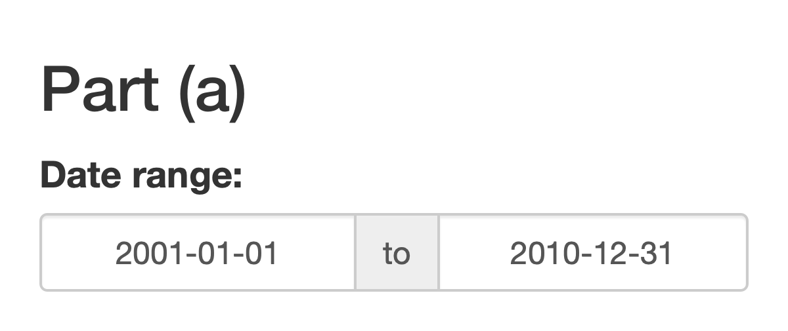
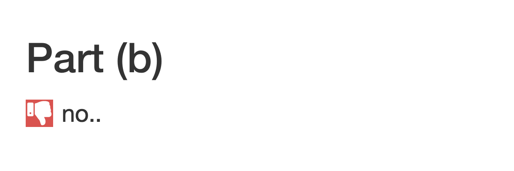
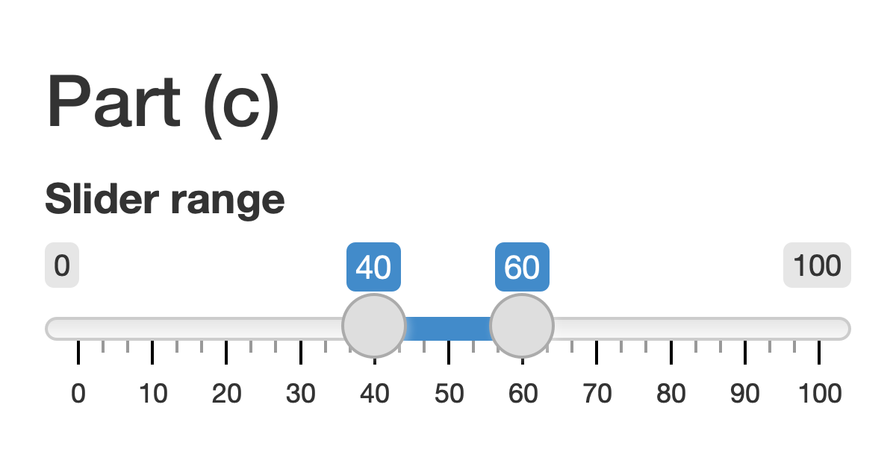

```{r, echo = FALSE, message = FALSE, warning = FALSE}
library(knitr)
library(webshot)
library(tidyverse)
opts_chunk$set(echo = TRUE, message = FALSE, warning = FALSE, cache = TRUE, dpi = 200, fig.align = "center", out.width = 650)
th <- theme_minimal() + 
  theme(
    panel.grid.minor = element_blank(),
    panel.background = element_rect(fill = "#f7f7f7"),
    panel.border = element_rect(fill = NA, color = "#0c0c0c", size = 0.6),
    axis.text = element_text(size = 14),
    axis.title = element_text(size = 16),
    legend.position = "bottom"
  )
theme_set(th)
options(width = 100)
```
class: bottom

# Reactivity

.pull-left[
February 16, 2022
]
 
---

### Announcements

* In-Class exercise grading
  - We will grade random subsets of submissions for points
  - All others will be graded for completeness
  - Everyone will be graded for points the same number of times
  - If you want feedback about a specific point, please indicate this in a
  Canvas comment
  
---

## Exercise 4.1 Discussion

---

### a

* References to `input` must occur within an appropriate `render`, `reactive`,
or `observe` context.
* These contexts help Shiny determine the graph of code dependencies

```{r, eval = FALSE}
server <- function(input, output) {
  input$name <- paste0("Welcome to shiny, ", input$name, "!")
  output$printed_names <- renderText({ input$name })
}
```

---

### b

The IDs for an output must be the same across both the UI and server components.

```{r, eval = FALSE}
ui <- fluidPage(
  ... 
  textOutput("printed_name")
)

server <- function(input, output) {
  output$printed_names <- ...
}
```

---

### c

Output types need to be matched. Either `renderText` or `renderVerbatimText` in
the server would make sense for a `textOutput` in the UI, but `renderDataTable`
does not provide the appropriate HTML.

```{r, eval = FALSE}
ui <- fluidPage(
  ...
  textOutput("printed_name")
)

server <- function(input, output) {
  output$printed_name <- renderDataTable({...
}
```

---

### d

`fluidPage` is a function, and it needs arguments to be separated by commas.

```{r, eval = FALSE}
ui <- fluidPage(
  titlePanel("Hello!")
  textInput("name", "Enter your name")
  textOutput("printed_name")
)
```

---

### 4.1 Option 2

.pull-left[
```{r code=readLines("apps/app1.R")}
```
]
.pull-right[
```{r, echo = FALSE, out.width = 500}
appshot(app = "apps/app1.R", file = "app1.png", zoom = 4, vwidth = 300, vheight = 100)

```
]

---

.pull-left[
```{r code=readLines("apps/app2.R")}
```
]

.pull-right[
```{r, echo = FALSE, out.width = 500}
appshot(app = "apps/app2.R", file = "app2.png", zoom = 4, vwidth = 300, vheight = 100)

```
]

---

.pull-left[
```{r code=readLines("apps/app3.R")}
```
]

.pull-right[
```{r, echo = FALSE, out.width = 500}
appshot(app = "apps/app3.R", file = "app3.png", zoom = 4, vwidth = 300, vheight = 100)

```
]

---

### Notes review

(go to [link](https://drive.google.com/file/d/1bdxWzmFolwDRlKoV6m29uSAeHQgce0wW/view?usp=sharing))

---

## Exercise

---

### Options

* Practice modularizing code: Improving an app [Module 1, Problem 28]
* Parsing real-world apps: Reactivity Graphs [Module 1, Problem 29]

---

### Hints

* For 28, notice that the expression `3 * input$x ^ 2 + 10` appears repeatedly
across multiple `render` contexts.
* For 28, notice that `current_data <- ` has been copied in several places
* For 29, focus on which `input$` expressions appear in which `render` and
`reactive` contexts

---

### Exercise

* Exercise 4.2 on Canvas
* Discuss in groups, but submit own solution
* Until: 

