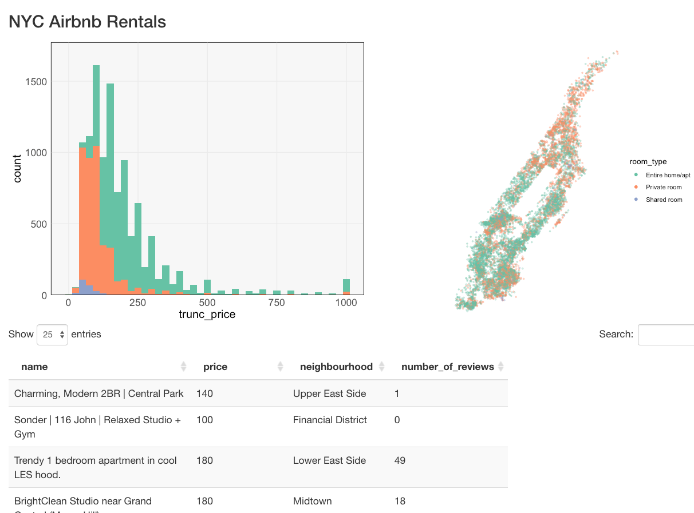
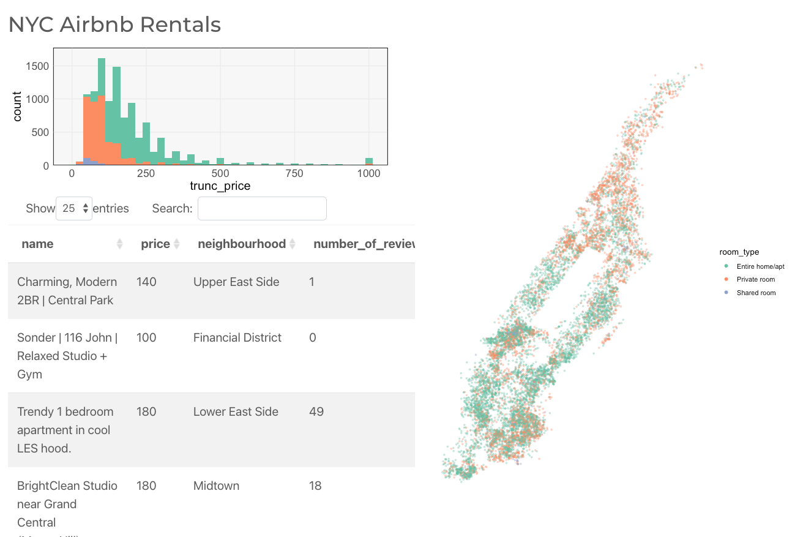

```{r, echo = FALSE, message = FALSE, warning = FALSE}
library(knitr)
library(webshot)
library(tidyverse)
library(shiny)
library(bslib)
opts_chunk$set(echo = TRUE, message = FALSE, warning = FALSE, cache = FALSE, dpi = 200, fig.align = "center", out.width = 650, fig.height = 3, fig.width = 9)
th <- theme_minimal() + 
  theme(
    panel.grid.minor = element_blank(),
    panel.background = element_rect(fill = "#f7f7f7"),
    panel.border = element_rect(fill = NA, color = "#0c0c0c", size = 0.6),
    axis.text = element_text(size = 14),
    axis.title = element_text(size = 16),
    legend.position = "bottom"
  )
theme_set(th)
options(width = 100)
```
class: bottom

# Linked Brushing, Continued

.pull-left[
  February 25, 2022
]
 
---

### Announcements

* Portfolio peer reviews description posted (February 27)
* Midterm Exam in-class next Monday (February 28)
* Portfolio 2 posted (March 13)
  
---

### Today

By the end of the class, you should be able to...

* Anticipate situations where `plotOutput` brush events may be unsatisfactory
* Apply the `crosstalk` library to link web-based plots

---

### Exercise 5.2 Review

* `selected()` is a reactive value that updates with every brush
* `scatterplot` and `overlay_histogram` render the figures.

```{r}
server <- function(input, output) {
  selected <- reactiveVal(rep(TRUE, nrow(rentals)))
  observeEvent(input$plot_brush, {
    selected(reset_selection(rentals, input$plot_brush))
  })
  
  output$histogram <- renderPlot(overlay_histogram(rentals, selected()))
  output$map <- renderPlot(scatterplot(rentals, selected()))
  output$table <- renderDataTable(filter(rentals, selected()))
}
```

---

The function that resets the selection is a wrapper of `brushedPoints`.

```{r}
reset_selection <- function(x, brush) {
  brushedPoints(x, brush, allRows = TRUE)$selected_
}
```

---

A minimal UI just stacks the three outputs.

```{r}
ui <- fluidPage(
  h3("NYC Airbnb Rentals"),
  plotOutput("histogram", brush = brushOpts("plot_brush", direction = "x")),
  dataTableOutput("table"),
  plotOutput("map", brush = "plot_brush")
)
```

---

We can arrange them more nicely if we use `fluidRow` or `column` to arrange the
components.

```{r, eval = FALSE}
ui <- fluidPage(
  h3("NYC Airbnb Rentals"),
  fluidRow(
    column(6, plotOutput("histogram", brush = brushOpts("plot_brush", direction = "x"))),
    column(6, plotOutput("map", brush = "plot_brush"))
  ),
  dataTableOutput("table"),
)
```

---

```{r, echo = FALSE}

```

---

```{r, eval = FALSE}
ui <- fluidPage(
  h3("NYC Airbnb Rentals"),
  fluidRow(
    column(6, 
      plotOutput("histogram", brush = brushOpts("plot_brush", direction = "x")),
      dataTableOutput("table")
    ),
    column(6, plotOutput("map", brush = "plot_brush"))
  ),
  theme = bs_theme(bootswatch = "minty")
)
```

---

```{r, echo = FALSE}

```

---

### Notes review

(go to [link](https://drive.google.com/file/d/1MUDi7VVqHsXCg7TAqEu2uY6hOifGPVuk/view?usp=sharing))

---

```{r}
library(tidyverse)
library(crosstalk)
library(plotly)
penguins <- read_csv("https://uwmadison.box.com/shared/static/ijh7iipc9ect1jf0z8qa2n3j7dgem1gh.csv") %>%
  mutate(id = row_number()) %>%
  SharedData$new()

p1 <- ggplot(penguins) +
  geom_point(aes(bill_length_mm, bill_depth_mm))
p2 <- ggplot(penguins) +
  geom_point(aes(flipper_length_mm, body_mass_g))
```

---

```{r}
p1 <- ggplotly(p1) %>%
   layout(dragmode = "lasso") %>%
   highlight(on = "plotly_selected")
p2 <- ggplotly(p2) %>%
   layout(dragmode = "lasso") %>%
   highlight(on = "plotly_selected")
bscols(p1, p2)
```

---

The `SharedData$new()` call was critical.

```{r}
penguins <- read_csv("https://uwmadison.box.com/shared/static/ijh7iipc9ect1jf0z8qa2n3j7dgem1gh.csv")

p1 <- ggplot(penguins) +
  geom_point(aes(bill_length_mm, bill_depth_mm))
p2 <- ggplot(penguins) +
  geom_point(aes(flipper_length_mm, body_mass_g))
```

---

The `SharedData$new()` call was critical.

```{r}
p1 <- ggplotly(p1) %>%
   layout(dragmode = "lasso") %>%
   highlight(on = "plotly_selected")
p2 <- ggplotly(p2) %>%
   layout(dragmode = "lasso") %>%
   highlight(on = "plotly_selected")
bscols(p1, p2)
```

---

### Exercise

With your project groups, write two slides to help you and your peers prepare
for the first midterm,

* Slide 1: Write a solution to a practice midterm question. Link to resources
that provide more information about the topic. Question assignments are given at
the link.
* Slide 2: Prepare a related question and solution.

---

### Exercise

* Exercise 5.3 on Canvas
* Until 2pm, then exchange with neighboring group
* Submit solutions as team
