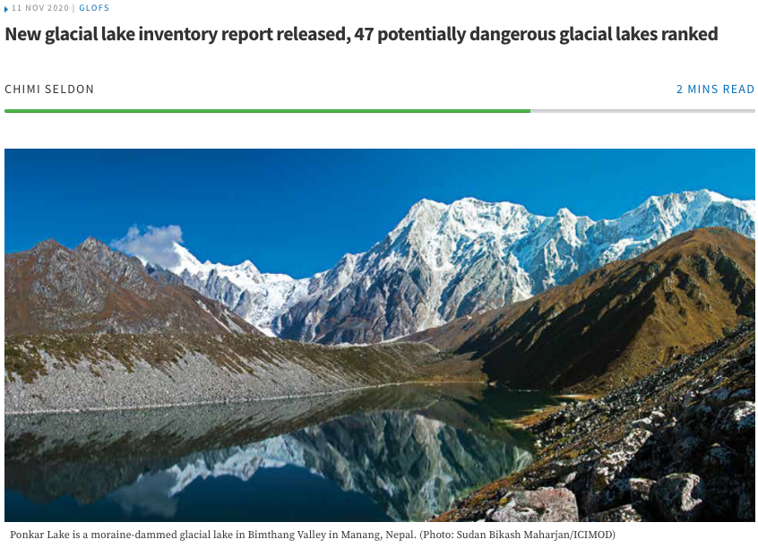

```{r, echo = FALSE, message = FALSE, warning = FALSE}
library(knitr)
library(tidyverse)
library(shiny)
opts_chunk$set(echo = TRUE, message = FALSE, warning = FALSE, cache = FALSE, dpi = 200, fig.align = "center", out.width = 650, fig.height = 3, fig.width = 9)
th <- theme_minimal() + 
  theme(
    panel.grid.minor = element_blank(),
    panel.background = element_rect(fill = "#f7f7f7"),
    panel.border = element_rect(fill = NA, color = "#0c0c0c", size = 0.6),
    axis.text = element_text(size = 14),
    axis.title = element_text(size = 16),
    legend.position = "bottom"
  )
theme_set(th)
options(width = 100)
```
class: bottom

# Geospatial Visualization (Part 1)

.pull-left[
  March 7, 2022
]
 
---

### Announcements

* Portfolio 2 - March 13
* Project Milestone 2 - March 13

---

### Today

By the end of the class, you should be able to...

  * Read in and explain the geometries contained in an `sf` class object
  * Create a polished, static visualization of an `sf` object

---

### Exercise 6.3 Review

d. The dataset
[here](https://uwmadison.box.com/shared/static/xj4vupjbicw6c8tbhuynw0pll6yh1w0d.csv)
contains similar data, but for all songs that appeared in the Spotify 100 for at
least 200 days in 2017. We have filtered to only the global totals. Read these
data into a tsibble, keyed by `artist:track_name` and extract features of the
`streams` time series using the `features` function in the feasts library. It is
normal to see a few errors reported by this function, it just means that some of
the statistics could not be calculated.

---

We use `as_tsibble` to convert the ordinary data.frame into a time-series aware
`tsibble`.

```{r}
library(tidyverse)
library(tsibble)
tracks <- read_csv("https://uwmadison.box.com/shared/static/xj4vupjbicw6c8tbhuynw0pll6yh1w0d.csv") %>%
  as_tsibble(index = date, key = artist:track_name)
head(tracks)
```
  
---

We can compute features associated with each track using `features`.

```{r}
library(feasts)
track_features <- tracks %>%
  features(streams, feature_set(tag = "trend")) %>%
  arrange(trend_strength)
head(track_features)
```

---

e. Which tracks had the highest and lowest `trend_strength`'s? Visualize their
streams over the course of the year.

```{r}
tracks %>%
  filter(track_name %in% c("Starboy", "Lose Yourself - Soundtrack Version")) %>%
  ggplot() +
  geom_line(aes(date, streams, group = track_name, col = track_name))
```

---

e. Which tracks had the highest and lowest `trend_strength`'s? Visualize their
streams over the course of the year.

```{r}
tracks %>%
  filter(track_name %in% c("Starboy", "Lose Yourself - Soundtrack Version")) %>%
  ggplot() +
  geom_line(aes(date, streams, group = track_name, col = track_name), size = 1) +
  scale_color_manual(values = c("#5743D9", "#03A66A")) +
  scale_y_continuous(label = scales::label_number_si())
```


---


f. Discuss one other feature that would be interesting to extract from these
time series. Provide a non-technical explanation about what songs with high
values of this feature would potentially look like.

This was very open ended. Some interesting answers are,
  - Are there songs that were extremely popular, but only briefly?
  - Are there songs whose popularity increased over time?
  - Are there songs that are popular on a seasonal time scale (e.g., Christmas?)
  - What are the songs with the largest range?
  
---

## Live Coding Example

We will work through Exercise 10 in Module 2 (parts a and c).

.pull-left[
First, take 2 minutes to discuss 

 * Who is the audience who would potentially be interested in this dataset?
 * What sorts of questions would they like answered?
 ]
 
 .pull-right[
```{r, echo = FALSE}

```
 
 ]

---

### Exercise

* Exercise 7.1 [Geospatial Commands] on Canvas
* Can discuss, but submit individually
* If you haven't installed the `sf` and `raster` packages, do that today! 