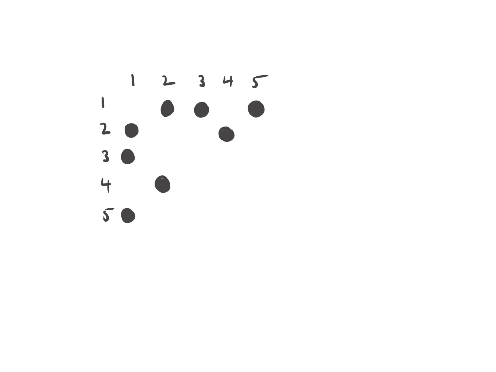
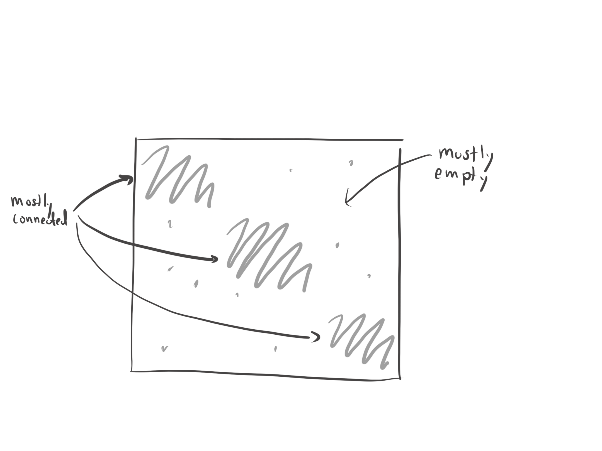

```{r, echo = FALSE, message = FALSE, warning = FALSE}
library(raster)
library(knitr)
library(tidyverse)
knitr::opts_chunk$set(warning = FALSE, message = FALSE, cache = TRUE)
```
\rule[-1mm]{19.3cm}{1mm}
Name: \rule[0pt]{7cm}{.5pt}\vspace{3mm}

* This exam lasts from 1:20 - 2:10pm on April 18, 2022. There are 6 questions.
* This exam is closed notes and closed computer.
* You may use a 1-page cheat sheet (8.5 x 11in or A4 size). You may use both
sides, but the cheat sheet must be handwritten.
* If you need extra space, you may write on the back of the page. Please
indicate somewhere that your answer continues.
* The instructors will only be able to answer clarifying questions during the
exam. They will be sitting at the back of the room.

| Question | Q1 | Q2 | Q3 | Q4 | Q5 | Q6 | Total |
| ---- | -- | -- | -- | -- | -- | -- | -- |
| Score |  |  |  |  |  |  |  |  | |
| Possible |  4 | 4 | 5 | 6 | 5 | 6 | 30  |

\rule[1mm]{19.3cm}{1mm}

### Q1 (4 points)

Circle TRUE or FALSE for all statements below about time series and geospatial
visualization.

  * TRUE or FALSE: The `geom_sf` layer can be used to visualize collection of
  spatial polygons of class `sf`.
  * TRUE or FALSE: The `geom_raster` layer can be used to visualize a
  multi-channel raster as an RGB image.
  * TRUE or FALSE: A gradually decreasing slope in an ACF visualization
  indicates a time series with strong seasonal structure.
  * TRUE or FALSE: If `x` is a data.frame with columns `date`, `city`, and
  `temperature`, then command `as_tsibble(x, key = city, index = date)` will
  correctly create a `tsibble` object containing the time series collection,
  assuming there are no gaps in time.
  * TRUE or FALSE: A per-pixel grid of temperature data is an example of a
  spatial vector dataset.
  
Answers,

  * TRUE: This layer is used to visualize `sf` objects, which store vector data.
  * FALSE: `geom_raster` only plots one raster channel at a time. For an RGB
  image, it's necessary to use `ggRGB` or `plotRGB`.
  * FALSE:  A gradually decreasing ACF indicates a strong trend. Seasonal
  structure can be found by locating spikes in the ACF.
  * TRUE: The `key` and `index` arguments are for the grouping and temporal
  variables, respectively.
  * FALSE: A per-pixel grid is an example of a raster dataset.

### Q2 (4 points)

Circle TRUE or FALSE for all statements below about clustering and topic models.
    
  * TRUE or FALSE: If all samples in a cluster have large silhouette statistics, then that
  cluster is poorly-defined.
  * TRUE or FALSE: Consider the `survey` dataset below,
        
    ```
      Country     `WBL Report Year` Question answer
      <chr>                   <dbl> <fct>     <dbl>
    1 Afghanistan              1971 Q1            0
    2 Afghanistan              1971 Q2            1
    3 Afghanistan              1971 Q3            0
    4 Afghanistan              1971 Q4            1
    ```
  
    To use $K$-means to cluster country $\times$ year combinations by their pattern of question responses, we would need to first pivot it using the command,
      
    ```{r, eval = FALSE}
    survey %>%
    	pivot_wider(names_from = "Country", values_from = "answer")
    ```	
      
  * TRUE or FALSE: Suppose a data.frame has a column, `reviews`, containing raw
  text from across a collection of reviews (one review per row). Then, the
  `cast_dtm` function can be used to split the raw text so that one word appears
  on each row.
  * TRUE or FALSE: A Structure plot visualizes the `n_samples` $\times$
  `K`-dimensional matrix of mixed memberships fitted by a topic model.
  * TRUE or FALSE: When cutting a hierarchical clustering tree at two heights,
  the clusters found at the height closer to the leaves will always be nested
  within the clusters found at the height closer to the root.
  
Answers

  * FALSE: When the silhouette statistics are large, then the clusters are
  well-defined.
  * FALSE: This would reshape the data so that we could cluster questions, but
  this is not our goal. We should use `survey %>% pivot_wider(names_from = "Question", values_from = "answer")` instead
  * FALSE: The correct function to use for this task is `unnest_tokens()`
  * TRUE: Structure plots are designed for the memberships matrices in topic models.
  * TRUE: The major difference between hierarchical clustering and $K$-means
  with different $K$ is that clusters from hierarchical clustering will always
  be nested within one another.

### Q3 (5 points)

Imagine that you have been tasked with training models of glacial change in the
Himalaya mountain range. You decide to first generate exploratory visualizations
of the relevant spatial data.

a. [2 points] The block below reads in an `sf` object with one row per glacier.
Provide code for visualizing these glaciers, faceted by the `Glaciers` category.
An example result is given in Figure \ref{fig:glaciers_sf}.

```{r}
library(sf)
glaciers <- read_sf("https://uwmadison.box.com/shared/static/k6htkjqj0w48g8oixfwq0zaobsny04jh.geojson") %>%
  filter(Longitude < 86.91, Longitude > 86.1, Latitude < 27.81, Latitude > 27.7)

glaciers[1:4, 1:5]
```
  
Since this is a spatial dataset, we need to use `geom_sf`. The `Glaciers` column
is used to facet the plot.

```{r, fig.cap = "An example result for Q3a. \\label{fig:glaciers_sf}", fig.align = "center", out.width = "0.5\\textwidth", echo = TRUE}
ggplot(glaciers) +
  geom_sf() +
  facet_wrap(~ Glaciers)
```

b. [1 point] The block below reads in a raster image for the same region. The
15th channel of this dataset contains information about the slope at each pixel
in the image. Provide code that could be used to visualize the slope at each
location in the dataset.

```{r}
image <- brick("https://uwmadison.box.com/shared/static/2z3apyg4t7ct5qd4mcwh9rpr63t02jql.tif")
```  

There are two approaches to this problem, one using `ggRGB` and the other using
plain `ggplot2`.
    
```{r}
# solution 1
image_df <- as.data.frame(image, xy = TRUE)
ggplot(image_df) +
    geom_raster(aes(x, y, fill = slope))

# solution 2
library(RStoolbox)
ggRGB(image, r = 15, g = 15, b = 15)
```

c. [2 points] Suggest an approach to layering the glacier boundaries from (a)
onto the slope map from (b). An example result is given in Figure
\ref{fig:glaciersoverlay}.

We can add the `geom_sf` layer from part (a) to either of the solutions from
part (b). Note that we have to use different datasets for the two layers.

```{r, fig.cap = "\\label{fig:glaciersoverlay} An example result for Q3c.", fig.align = "center", out.width = "0.8\\textwidth"}
ggRGB(image, r = 15, g = 15, b = 15, alpha = 0.5) +
  geom_sf(data = glaciers, col = "red") +
  facet_wrap(~ Glaciers)
```

```{r, fig.align = "center", out.width = "0.8\\textwidth"}
ggplot(image_df) +
  geom_raster(aes(x, y, fill = slope)) +
  geom_sf(data = glaciers, col = "red") +
  facet_wrap(~ Glaciers)
```

### Q4 (6 points)

In this problem, we will see how a heatmap can visualize user ratings across a
collection of movies.

```{r}
movies_mat <- read_csv("https://uwmadison.box.com/shared/static/wj1ln9xtigaoubbxow86y2gqmqcsu2jk.csv") %>%
  column_to_rownames(var = "title")
movies_mat[1:4, 1:6]
```

a. [2 points] Provide code to generate the heatmap shown in Figure \ref{fig:movies}.

We can generate this heatmap using `superheat` with the `pretty.order*` arguments
set to TRUE.

```{r, echo = TRUE, fig.height = 10, fig.width = 18, out.width = "0.6\\textwidth", fig.cap = "\\label{fig:movies} A heatmap of movie ratings for Q4a.", fig.align = "center"}
library(superheat)
superheat(movies_mat, pretty.order.rows = TRUE, pretty.order.cols = TRUE)
```

b. [2 points] In this visualization, how do you interpret sets of similar rows?
Similar columns?

Similar rows correspond to movies with similar ratings profiles across users.
These are movies that tend to be watched by the same types of people and which
elicit similar reactions across audience members.

Similar columns correspond to users who watch the same types of movies and who
give them similarly low or high ratings.

c. [2 points] Propose an alternative compound plot that allows readers to easily
find average movie ratings. Draw a simple sketch of what the output would look
like and describe any necessary modifications to the code in part (a).

We can compute the average rating across rows and then add these ratings rowwise
to the heatmap in part (a).

```{r, echo = TRUE, fig.height = 10, fig.width = 14, out.width = "0.8\\textwidth", fig.cap = "\\label{fig:movies} Your sketch for Q4c could look like this.", fig.align = "center"}
superheat(
  movies_mat, 
  yr = rowMeans(movies_mat),
  yr.plot.type = "bar",
  pretty.order.rows = TRUE,
  pretty.order.cols = TRUE
)
```

### Q5 (5 points)

The code below reads in nodes and edges for a graph describing the similarity of
512 HIV samples collected across 32 countries. Two samples are linked if they
have similar genetic sequences.

```{r, echo = TRUE, warning = FALSE, message = FALSE}
library(tidygraph)
nodes <- read_csv("https://raw.githubusercontent.com/krisrs1128/stat479_s22/main/_slides/week11/exercises/hiv_nodes.csv")
edges <- read_csv("https://raw.githubusercontent.com/krisrs1128/stat479_s22/main/_slides/week11/exercises/hiv_edges.csv")
G <- tbl_graph(nodes, edges)
G
```

a. [2 points] Provide code to generate a node-link visualization similar to that
in Figure \ref{fig:hiv_graph}. Make at least one style customization that
improves the visualization. Justify your choice.

We expect you to use `ggraph`, with layers for `geom_edge_link` and
`geom_node_text`. We expect customization of the theme, edges, or nodes that
improved node clarity and removed background clutter. We expect an `aes`
encoding the node `name` field, which contained country names.

```{r, echo = TRUE, fig.width = 10, fig.height = 10, out.width = "0.7\\textwidth", fig.cap = "\\label{fig:hiv_graph} A network between HIV sequences, labeled by the country from which they originated.", fig.align = "center"}
library(ggraph)
ggraph(G) +
  geom_edge_link(colour = "#d3d3d3", alpha = 0.9, width = 2) +
  geom_node_text(aes(label = name)) +
  theme_void()
```
  
b. [1 point] Figure \ref{fig:graph1} shows the node-link visualization for a
simple graph. Sketch its exact adjacency matrix visualization.

```{r, echo = FALSE, out.width = "0.3\\textwidth", fig.width = 5, fig.height = 5, fig.cap = " \\label{fig:graph1} Network for problem Q5b.", fig.align = "center"}
library(igraph)
G <- as_tbl_graph(sample_pa(5)) %>%
  mutate(node = 1:5)
ggraph(G, layout = "kk") +
  geom_edge_link() +
  geom_node_label(aes(label = node)) +
  theme_void()
```

The true adjacency matrix is given below.

```{r, out.width = "0.5\\textwidth", fig.align = "center", echo = FALSE}

```

c. [2 points] Figure \ref{fig:graph2} shows the node-link visualization for a
more complex graph. How do you expect its corresponding adjacency matrix
visualization to look? Provide a rough sketch and a one-sentence justification.

Since there are three groups of nodes that are tightly connected, there will be
three dense blocks in the adjacency matrix visualization.

```{r, out.width = "0.5\\textwidth", fig.align = "center", echo = FALSE}

```

```{r, echo = FALSE, out.width = "0.3\\textwidth", fig.width = 10, fig.height = 10, fig.cap = "\\label{fig:graph2} Network for problem Q5c.", fig.align = "center"}
G <- as_tbl_graph(sample_islands(3, 40, .12, 2))
ggraph(G) +
  geom_edge_link() +
  geom_node_point() +
  coord_fixed() +
  theme_void()
```

### Q6 (6 points)

This problem asks you to explain, in your own words, a few of the conceptual and
practical aspects for **one of the following** dimensionality reduction
techniques,

  * Principal Components Analysis (PCA)
  * Uniform Manifold Approximation and Projection (UMAP)
  * Latent Dirichlet Allocation (LDA)
  
a. [3 points] Outline how you would implement this method in R and extract
output needed for downstream visualizations. Make sure to highlight the the most
important steps and functions and briefly explain any code you write down.

For PCA and UMAP, the first steps of any implementation will look like

```{r, eval = FALSE}
library(tidymodels) # load necessary library

model_recipe <- recipe(~ ., data = x) %>% # setup the recipe object
  update_role(descriptor_1, ..., descriptor_M, new_role = "id") %>% # specify features not to use in the PCA
  step_normalize(all_predictors()) %>% # optionally normalize all the predictors
```

For PCA, we would then add the line,

```{r, eval = FALSE}
... %>%
  step_pca(all_predictors()) # final PCA definition

fit <- prep(model_recipe) # run the PCA
scores <- juice(fit) # extract scores
components <- tidy(fit, 2) # get the principal components
```

while for UMAP we would add,

```{r, eval = FALSE}
library(embed) # needed for UMAP

... %>%
  step_umap(all_predictors()) # final UMAP definition

fit <- prep(model_recipe) # run the UMAP
scores <- juice(fit) # extract scores
```

We have assumed that the data `x` are already in "wide" format. Otherwise, we
would need to use a `pivot_wider` command to place all features along columns.

LDA follows a somewhat different structure. Supposing that `x` has columns
called `id` giving the document ID and `text` containing raw text for modeling,
we would first build a `DocumentTermMatrix` using

```{r, eval = FALSE}
library(tidytext)
text_dtm <- x %>%
  unnest_tokens(word, text) %>% # split words onto separate rows. optionally, can filter stopwords
  count(id, word) %>% # get word counts per document
  cast_dtm(id, word, n) # convert into a "wide" DTM object
```

At this point, we can fit an LDA model and extract the parameter matrices.

```{r, eval = FALSE}
library(topicmodels) # needed for LDA
fit <- LDA(text_dtm, k = K) # fit the topic model
topics <- tidy(fit, matrix = "beta") # extract topic distributions
memberships <- tidy(fit, matrix = "gamma") # extract per-document memberships
```

b. [3 points] Describe the outputs from (a). How is each part interpreted? Be as
specific as possible.

For PCA, the outputs are,

  * `scores`: The $N \times K$ dimensional coordinates of the
  data with respect to the learned principal components. These represent a "map"
  of the raw data in the most important directions of variation.
  * `components`: The $D \times K$ dimensional coefficients
  of the linear combination used to derive the new, high-variance PCA features.
  Equivalently, the axes defining the $K$-dimensional plane that best
  approximates the data.
  
For UMAP, the outputs are,

  * `scores`: The $N \times K$ dimensional coordinates of the
  data with in the learned embedding space. These represent a "map" of the data
  that preserves local (potentially nonlinear) structure.
  
For LDA, the outputs are,

  * `memberships`: The $N \times K$ dimensional membership
  vectors for each sample across the $K$ learned topics. Each row sums to 1,
  giving proportional assignments to each topic.
  * `topics`: The $D \times K$ dimensional distributions
  over words, encoding the main co-occurrence patterns of words across the
  document collection.
