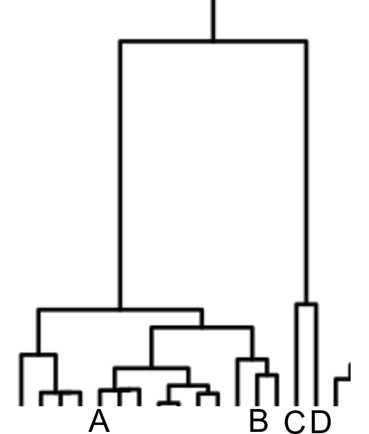
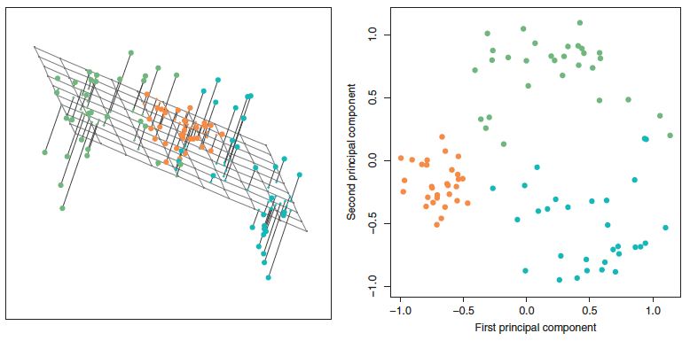
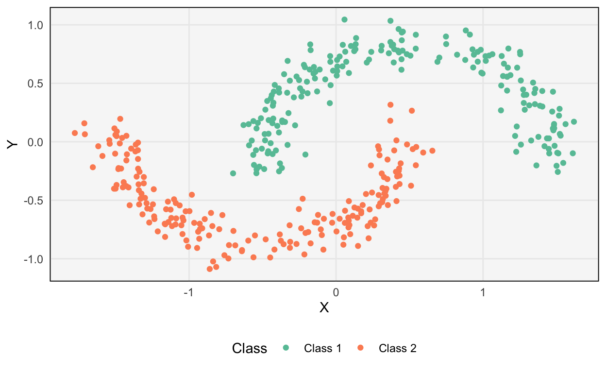

```{r, echo = FALSE, message = FALSE, warning = FALSE}
library(raster)
library(knitr)
library(tidyverse)
knitr::opts_chunk$set(warning = FALSE, message = FALSE, cache = TRUE)
library(tidyverse)
th <- theme_minimal() + 
  theme(
    panel.grid.minor = element_blank(),
    panel.background = element_rect(fill = "#f7f7f7"),
    panel.border = element_rect(fill = NA, color = "#0c0c0c", size = 0.6),
    axis.text = element_text(size = 14),
    axis.title = element_text(size = 16),
    legend.position = "bottom"
  )
theme_set(th)
```

\rule[-1mm]{19.3cm}{1mm}
Name: \rule[0pt]{7cm}{.5pt}\vspace{3mm}

* This exam lasts from 1:20 - 2:10pm on April 18, 2022. There are 6 questions.
* This exam is closed notes and closed computer.
* You may use a 1-page cheat sheet (8.5 x 11in or A4 size). You may use both
sides, but the cheat sheet must be handwritten.
* If you need extra space, you may write on the back of the page. Please
indicate somewhere that your answer continues.
* The instructors will only be able to answer clarifying questions during the
exam. They will be sitting at the back of the room.

| Question | Q1 | Q2 | Q3 | Q4 | Q5 | Q6 | | Total |
| ---- | -- | -- | -- | -- | -- | -- | -- |
| Score |  |  |  |  |  |  |  |  | |
| Possible |  4 | 4 | 4 | 6 | 6 | 6 | 30  |

\rule[1mm]{19.3cm}{1mm}

### Q1 (4 points)

Circle all TRUE or FALSE statements below about network visualization.

  * **TRUE** or FALSE: For tasks related to local topology, node-link diagrams are preferable to adjacency matrix visualizations.
  * TRUE or **FALSE**: For large networks, node-link diagrams are preferable to
  adjacency matrix visualizations.
  * TRUE or **FALSE**: If `G` is a `tbl_graph` defining a network, then an adjacency matrix visualization can be created using
    
    ```{r, eval = FALSE}
    ggraph(G) +
      geom_adjaceny()
    ```

  * **TRUE** or FALSE: The `treemap` and `circlepack` layouts in `ggraph` can be
  used to visually represent enclosure relationships between nodes in a graph.
  * TRUE or **FALSE**: The adjacency matrix visualization of a directed graph
  will generally be symmetric across the diagonal.
  

### Q2 (4 points)

The figure below shows a subset of a large hierarchical clustering tree,
generated using the code

```{r, eval = FALSE}
d <- dist(x)
h <- hclust(d)
plot(h)
```

```{r, echo = FALSE, fig.align = "center", fig.cap = "Figure for Q2."}

```
    
Circle all TRUE or FALSE statements about the resulting clustering below.

* TRUE or **FALSE**: Samples C and D are more similar to one another than A and B.
* TRUE or **FALSE** If this subtree were cut to form $K = 5$ clusters, then C and D
would belong to the same cluster.
* **TRUE** or FALSE: A and B are more similar to each other than B and C.
* **TRUE** or FALSE: If this subtree were cut to form $K = 2$ clusters, then A
and B would belong to the same cluster.

### Q3 (4 points)

This problem asks you to compare and contrast dimensionality reduction using and
UMAP and PCA.

  a. [2 points] Provide an example of a dataset for which using PCA would be
  more appropriate than UMAP. Justify your choice.
  
  You can provide any dataset where linear features are sufficient. For example,
  you could sketch a set of points lying near a plane in three dimensional space.
  
```{r, echo = FALSE, out.width = "0.4\\textwidth", fig.align = "center"}

```
  
  You can describe any large dataset, e.g., $> 10,000$ rows, for which the
  iterative computation needed for UMAP is impractical.

  b. [2 points] Provide an example of a dataset for which using UMAP would be
  more appropriate than PCA. Justify your choice.
  
  Any dataset with substantial nonlinearity would be appropriate. For example, you
  could propose the "two moons" dataset. UMAP is preferred in this case because no
  linear feature can clearly separate the two classes.
    
```{r, echo = FALSE, out.width = "0.4\\textwidth", fig.align = "center"}

```
    

### Q4 (6 points)

This problem considers visualization of a glaciers dataset.

```{r}
glaciers <- brick("https://uwmadison.box.com/shared/static/2z3apyg4t7ct5qd4mcwh9rpr63t02jql.tif")
glaciers
```
    
  a. [2 points] Identify one difference between classes `RasterBrick` and `sf`.
  Describe a type of dataset that could be stored as an `sf` object, but not a
  `RasterBrick`.
  
  Possible answers for the first part,
  
  * A raster describes spatial information measured on a regular grid
  * An `sf` can be used to store points, lines, polygons, multipolygons, and
  other geometric datasets defined by vector coordinates.
  
  Possible answers for the second part,

  * Locations of trees, each stored as a point object
  * A network of roads, with markers on the road specified by points on a line
  * Boundaries of buildings, each stored as a small polygon
  
  b. [1 points] Assume that the first three channels in the dataset correspond
  to red, green, and blue color channels. Provide code that could be used to
  generate the Figure in \ref{fig:rgb}. Make sure that your code loads necessary
  libraries.
  
```{r, fig.cap="\\label{fig:rgb} Figure for Q4b.", out.width = "0.3\\textwidth", fig.align = "center", out.width = "0.4\\textwidth"}
library(RStoolbox)
ggRGB(glaciers)
```
  
  c. [3 points] The 15th channel of this dataset contains information about the
  slope at each pixel in the image. Provide code that could be used to visualize
  the slope at each location in the dataset.
  
```{r, out.width = "0.4\\textwidth", fig.align = "center"}
## solution 1
ggRGB(glaciers, r = 15, g = 15, b = 15)

## solution 2
glaciers_subset <- as.data.frame(glaciers, xy = TRUE)
ggplot(glaciers_subset) +
  geom_raster(aes(x, y, fill = slope)) # could just call it "channel_15"
```
    
  
### Q5 (6 points)

The polio dataset contains weekly counts of new polio cases across each state in
the United States, starting as early as 1912. In this question, our goal is to
apply $K$-means to group states with similar incidence patterns.

```{r}
polio <- read_csv("https://uwmadison.box.com/shared/static/nm7yku4y9q7ylvz5kbxya3ouj2njd0x6.csv")
head(polio)
```
  
a. [2 points] Is it necessary to reshape the data before it can be used in the
`kmeans` function? If so, provide the code. If not, provide a brief
explanation.
  
Yes, it is necessary to reshape these data. If we don't pivot, then $K$-means
will cluster the `state` $\times$ `period_start_date` combinations, not the full
temporal trajectories for each state.
  
```{r}
x <- polio %>%
  pivot_wider(names_from = "period_start_date", values_from = "cases", values_fill = 0)
x[1:4, 1:8]
```

b. [2 points] Let `x` contain the output from part (a). Compare the two
approaches to $K$-means in the code block below. Which would you recommend
using? Justify your choice.
  
Either option is acceptable, as long as it is accompanied by an appropriate
justification.
  
Option 1: All weeks are measuring the same quantity -- the number of polio
cases. Therefore, they can all be considered to be on the same scale, so there
is no need to include a normalization step.

```{r, eval = FALSE}
fit <- x %>%
  select(-state) %>%
  kmeans(centers = 5)
```
          
Option 2: Some weeks have many more cases than others, and if we fail to
scale, then the clustering will be essentially determined by these rare
outbreak periods. If we want all time periods to contribute to our measure of
sample similarity, then we must scale.

```{r}
fit <- x %>%
  select(-state) %>%
  scale() %>%
  kmeans(centers = 5)
```
    
  c. [2 points] Provide code needed for extracting and visualizing centroids
  from the $K$-means fit made in part (b). Draw a rough sketch of the expected
  result and include annotations that would help a reader understand the output.
  
One option is to use superheat,

```{r, fig.height = 5, fig.width = 10, out.width = "0.8\\textwidth"}
library(superheat)
superheat(fit$centers)
```

Alternatively, we can create a data.frame and use `ggplot2`.

```{r, fig.height = 6, fig.width = 10, out.width = "0.8\\textwidth"}
centroids <- as.data.frame(fit$centers) %>%
  rownames_to_column("cluster") %>%
  pivot_longer(-cluster, names_to = "week") %>%
  mutate(week = as.Date(week)) # wouldn't expect you to remember this

ggplot(centroids) +
  geom_line(aes(week, value)) +
  facet_wrap(~ cluster)
```
  
### Q6 (6 points)

The PBS dataset contains the number of orders filed every month for different
classes of pharmaceutical drugs, as tracked by the Australian Pharmaceutical
Benefits Scheme.

```{r}
pbs <- read_csv("https://uwmadison.box.com/shared/static/fcy9q1uleqru7gcs287q903y0rcnw2a2.csv") %>%
  mutate(Month = as.Date(Month))
head(pbs)
```

a. [1 points] Provide code that transforms the data into a `tsibble` object.
Note that there is a separate time series for each drug, identified by the
`ATC2_desec` key.

Any of the approaches below would work.

```{r}
library(tsibble)

pbs_ts <- tsibble(pbs, index = Month, key = ATC2_desc)
pbs_ts <- as_tsibble(pbs, index = Month, key = ATC2_desc)
pbs_ts <- tsibble(pbs, index = "Month", key = "ATC2_desc")
pbs_ts <- as_tsibble(pbs, index = "Month", key = "ATC2_desc")
```

b. [2 points] Provide code that extracts features for this time series
collection. How would you find the series with the largest `trend_strength`.

We can extract features using `features` from the `feasts` package.
    
```{r}
library(feasts)
pbs_features <- features(pbs_ts, Scripts, feature_set("feasts"))
```
    
We can arrange to find the series with the largest `trend_strength`.
    
```{r}
pbs_features %>%
  arrange(-trend_strength)
```
  
  
c. [1 points] Perform a PCA on the following subset of extracted features (these
are `trend_strength`, features that start with `seasonal`, or features
containing the string `acf`),
    
```{r}
features <- c("trend_strength", "seasonal_strength_week", "seasonal_peak_week", "seasonal_trough_week", "stl_e_acf1", "stl_e_acf10", "acf1", "acf10", "diff1_acf1", "diff1_acf10", "diff2_acf1", "diff2_acf10", "season_acf1", "pacf5", "diff1_pacf5", "diff2_pacf5", "season_pacf")
```

Make sure to normalize all features first.

```{r}
library(tidymodels)
pbs_features <- pbs_features %>%
  select(ATC2_desc, trend_strength, features)
pca_rec <- recipe(~ ., data = pbs_features) %>%
  update_role(ATC2_desc, new_role = "id") %>%
  step_normalize(all_predictors()) %>%
  step_pca(all_predictors())
pca_prep <- prep(pca_rec)
```
  
d. [2 points] Sketch code that could be used to visualize the top two principal
components. How would you interpret the resulting visualization?
  
    ```{r}
    library(tidytext)
    components <- tidy(pca_prep, 2) %>%
      filter(component %in% str_c("PC", 1:2)) %>%
      mutate(terms = reorder_within(terms, abs(value), component)) %>%
      group_by(component) %>%
      top_n(20, abs(value))
    
    ggplot(components, aes(value, terms)) +
      geom_col() +
      facet_wrap(~ component, scales = "free_y") +
      scale_y_reordered()
    ```
  
      We would look at the coordinates with large absolute values in each
      component. Time series with very large (or small) values for these PC
      directions will have values for those coordinates that are far in the same
      (or opposite) direction.